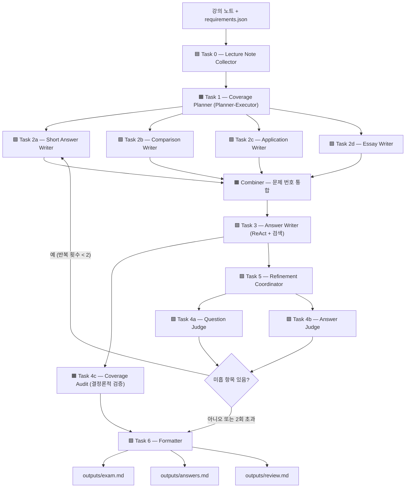

# Automated Exam Generation — Scientific Management HW #2

> **이 README는 AI Agent 프로그래밍을 처음 접하는 독자를 위해 작성되었습니다.**
> 코드를 보기 전에 이 문서를 끝까지 읽으면 시스템 전체 흐름을 이해할 수 있습니다.

---

## 1. 이 프로젝트가 하는 일

이 시스템은 **과학적 관리론 중간고사 시험지를 자동으로 만들어 주는 AI 에이전트 파이프라인**입니다.

강의 슬라이드 PDF 파일들을 입력으로 넣으면, 시스템이 스스로:

1. 강의 내용을 읽고 파악한다
2. 어떤 주제에서 몇 점 분량의 문제를 낼지 계획한다
3. 문제 유형별(단답형·비교형·적용형·서술형)로 문제를 동시에 작성한다
4. 각 문제에 대한 모범 답안을 작성한다
5. 문제와 답안의 품질을 심사하고 미흡한 항목을 재작성한다
6. 최종 시험지·정답지·검토 보고서를 파일로 저장한다

사람이 직접 해야 하는 일은 전체의 약 20%로, "최종 범위 확인", "공정성 검토", "배점 승인" 단계만 남겨 두었습니다.

---

## 2. AI 에이전트(Agent)란?

> 이 섹션은 AI Agent 개념이 처음인 독자를 위한 배경 설명입니다. 이미 알고 있다면 3번으로 넘어가세요.

**에이전트(Agent)** 란 LLM(대형 언어 모델)에 "도구"와 "역할"을 부여해 특정 임무를 자율적으로 수행하게 만든 프로그램 단위입니다.

| 일반 LLM 사용 | 에이전트 사용 |
|---|---|
| 사람이 매번 프롬프트를 입력한다 | 에이전트가 스스로 다음 단계를 결정한다 |
| 한 번에 하나의 질문에 답한다 | 여러 도구를 순서대로 호출해 복잡한 작업을 완료한다 |
| 이전 대화 맥락이 금방 사라진다 | 메모리·데이터베이스를 통해 정보를 유지한다 |

이 프로젝트는 12개의 에이전트가 **조립 라인처럼 협력**하여 시험지를 만들어 냅니다. 각 에이전트는 정해진 역할(Task)만 담당하고, 결과물을 다음 에이전트에게 넘겨 줍니다.

---

## 3. 시스템 구조 한눈에 보기

```
lecture_notes/raw/*.pdf   (입력: 강의 슬라이드)
        │
        ▼  [scripts/extract_pdf_text.py]
lecture_notes/processed/*.txt   (텍스트 추출 완료)
        │
        ▼  [src/main.py — 12개 에이전트 파이프라인]
        │
        ├── Task 0  LectureNoteCollectorAgent   강의 내용 수집·등록
        ├── Task 1  CoveragePlannerAgent         출제 계획 수립
        ├── Task 2  (4개 에이전트 병렬 실행)
        │    ├── ShortAnswerWriterAgent          단답형 문제 작성
        │    ├── ComparisonWriterAgent           비교형 문제 작성
        │    ├── ApplicationWriterAgent          적용형 문제 작성
        │    └── EssayWriterAgent               서술형 문제 작성
        ├── Task 3  AnswerWriterAgent            모범 답안 작성
        ├── Task 4  (심사·감사 병렬 실행)
        │    ├── QuestionJudgeAgent             문제 품질 심사
        │    ├── AnswerJudgeAgent               답안 품질 심사
        │    └── CoverageAuditAgent             범위·배점 검증
        ├── Task 5  RefinementCoordinator        미흡 항목 재작성 루프
        └── Task 6  FormatterAgent              최종 파일 출력
                │
                ▼
        outputs/exam.md        (시험지)
        outputs/answers.md     (정답지)
        outputs/review.md      (검토 보고서)
```

---

## 4. 에이전트 흐름도 (APD)

아래 다이어그램은 각 Task의 실행 순서와 분기를 보여 줍니다.
색상은 강의 규약을 따릅니다: 🟦 정보 수집 / 🟧 정보 분석 / 🟪 의사결정 / 🟩 실행



---

## 5. 에이전트별 상세 설명

각 에이전트가 구체적으로 무엇을 하는지, 어떤 AI 패턴을 사용하는지 설명합니다.

### Task 0 — LectureNoteCollectorAgent
**역할**: `lecture_notes/processed/` 폴더의 텍스트 파일을 읽어 `outputs/processed_notes_db.json`에 등록합니다.

- 이미 등록된 파일은 건너뛰어 중복 처리를 방지합니다.
- 이후 에이전트들은 이 JSON DB를 통해 강의 내용을 조회합니다.
- **패턴**: Application Collector + JSON Database (강의 M5.3.2)

---

### Task 1 — CoveragePlannerAgent
**역할**: 강의 내용과 `requirements.json`(출제 기준)을 분석해 "어떤 주제에서 몇 점 분량의 문제를 낼 것인가"를 담은 JSON 계획을 작성합니다.

출력 예시:
```json
[
  {"key": "work_and_work_systems", "title": "일과 작업 시스템", "weight": 25, "keywords": ["DASSI", "작업 시스템"]},
  {"key": "scientific_management",  "title": "과학적 관리",     "weight": 20, "keywords": ["Taylor", "4원칙"]}
]
```

- **패턴**: Planner-Executor (강의 M5.3.3) — 계획자가 먼저 계획을 세우고, 실행자(Task 2)들이 그에 따라 움직입니다.

---

### Task 2 — 문제 작성 에이전트 (4개 병렬 실행)
**역할**: 4종류의 문제를 동시에 작성합니다. `ThreadPoolExecutor`를 사용해 병렬로 실행되므로 하나씩 순서대로 실행하는 것보다 빠릅니다.

| Task | 에이전트 | 문제 유형 | 배점 |
|------|---------|----------|------|
| 2a | `ShortAnswerWriterAgent`  | 단답형 — 정의, 열거 | 각 ~5점 × 6문제 |
| 2b | `ComparisonWriterAgent`   | 비교형 — 두 개념 대조 | 각 ~10점 × 2문제 |
| 2c | `ApplicationWriterAgent`  | 적용형 — 시나리오 분석 | 각 ~15점 × 2문제 |
| 2d | `EssayWriterAgent`        | 서술형 — 주제 통합 논술 | ~20점 × 1문제 |

4개 에이전트의 출력은 **Combiner**가 합쳐 Q1~Q11로 번호를 통일합니다.

- **패턴**: Specialist Parallel Fan-out (강의 M5.3.3)

---

### Task 3 — AnswerWriterAgent
**역할**: 각 문제에 대한 모범 답안을 작성합니다. 단순히 LLM에게 "답을 써 달라"고 요청하는 것이 아니라, **ReAct 패턴**을 사용해 실제 강의 자료에서 근거를 찾아 인용합니다.

**ReAct 패턴이란?**
```
Thought:  "테일러의 4원칙에 대한 답안을 작성하려면 관련 강의 내용을 찾아야 한다"
Action:   search_lecture_notes(keyword="Taylor 4원칙")
Observation: "[M5.1 강의 노트] 과업 관리, 과학적 선발..."
Answer:   관찰된 내용을 바탕으로 답안 작성 + 출처(source_refs) 기록
```

Thought → Action → Observation 사이클을 반복해 답안의 근거를 강의 자료에서 직접 확보합니다.

- **패턴**: ReAct + Retrieval Tool (강의 M5.3.1.2 §8)

---

### Task 4a — QuestionJudgeAgent
**역할**: 작성된 문제를 4개 항목으로 채점합니다.

| 항목 | 설명 | 만점 |
|------|------|------|
| `scope_alignment` | 강의 범위와 일치하는가 | 7점 |
| `difficulty` | 난이도가 적절한가 | 5점 |
| `clarity` | 문제가 명확한가 | 5점 |
| `answerable` | 강의 내용으로 풀 수 있는가 | 5점 |

총점 기준: **17점 이상 GOOD**, **13~16점 ACCEPTABLE**, **12점 이하 POOR**

- **패턴**: LLM-as-Judge with JSON Rubric (강의 M5.3.4)

---

### Task 4b — AnswerJudgeAgent
**역할**: 작성된 모범 답안을 4개 항목으로 채점합니다.

| 항목 | 설명 | 만점 |
|------|------|------|
| `accuracy` | 내용이 정확한가 | 7점 |
| `completeness` | 핵심 내용이 빠짐없이 포함되었는가 | 7점 |
| `lecture_grounded` | 강의 자료에 근거했는가 | 5점 |
| `concise` | 간결하게 서술되었는가 | 3점 |

- **패턴**: LLM-as-Judge with JSON Rubric (강의 M5.3.4)

---

### Task 4c — CoverageAuditAgent
**역할**: LLM 없이 규칙 기반으로 구조적 요건을 검증합니다. 실패하면 review.md에 경고를 기록합니다.

검증 항목:
- 전체 배점 합계 = 100점
- `requirements.json`에 지정된 주제가 모두 포함되었는가
- 문제 유형별 개수가 요건과 일치하는가

- **패턴**: Deterministic (결정론적) — LLM을 사용하지 않아 항상 같은 결과를 냅니다.

---

### Task 5 — RefinementCoordinator
**역할**: Task 4a·4b의 심사 결과를 종합하고, POOR 판정을 받은 문제·답안을 재작성합니다. 이 과정을 최대 2회 반복합니다.

반복 루프 흐름:
```
[1회차 심사] → POOR 문제 발견 → judge의 suggestion을 프롬프트에 주입 → 해당 문제만 재작성
[2회차 심사] → 여전히 POOR이면 현재 상태 유지 (인간 검토로 넘김)
```

최대 반복 횟수를 2회로 제한한 이유: LLM이 무한히 수정하다 더 나빠지는 경우를 방지하고, 사람이 최종 판단할 여지를 남기기 위해서입니다.

- **패턴**: Supervisor-Evaluator Reflection Loop (강의 M5.3.3)

---

### Task 6 — FormatterAgent
**역할**: 지금까지 만들어진 데이터를 3개의 파일로 저장합니다.

| 파일 | 내용 |
|------|------|
| `outputs/exam.md` | 수험생용 시험지 (문제만) |
| `outputs/answers.md` | 강사용 정답지 (문제 + 모범 답안 + 출처) |
| `outputs/review.md` | 검토 보고서 (범위 감사 결과, 심사 점수, 재작성 이력) |

- **패턴**: Deterministic local tool (LLM 없이 문자열 조립)

---

## 6. 데이터 흐름 요약

```
[입력]
  lecture_notes/raw/*.pdf
        │
        │ scripts/extract_pdf_text.py
        ▼
  lecture_notes/processed/*.txt
        │
        │ Task 0: LectureNoteCollectorAgent
        ▼
  outputs/processed_notes_db.json   ◄──── 이후 모든 에이전트가 참조
        │
        │ Task 1: CoveragePlannerAgent
        ▼
  coverage_plan (JSON 객체, 메모리 내 전달)
        │
        │ Task 2: 4개 에이전트 병렬 실행
        ▼
  questions[] (메모리 내 전달)
        │
        │ Task 3: AnswerWriterAgent
        ▼
  questions[] + answers[] (메모리 내 전달)
        │
        │ Task 4c: CoverageAuditAgent
        │ Task 5: RefinementCoordinator (→ 4a, 4b 포함)
        ▼
  refined_questions[], refined_answers[], verdicts[]
        │
        │ Task 6: FormatterAgent
        ▼
[출력]
  outputs/exam.md
  outputs/answers.md
  outputs/review.md
```

---

## 7. 메모리 전략

에이전트가 정보를 "기억"하는 방식에는 여러 층위가 있습니다. 이 프로젝트는 4가지 메모리 층위를 사용합니다(강의 M5.3.2).

| 층위 | 설명 | 이 프로젝트에서 |
|------|------|----------------|
| LLM 가중치(내재 지식) | Taylor·Gilbreth 등 도메인 지식은 LLM이 이미 학습으로 알고 있음 | `GeminiProvider` 모델 자체 |
| 단기 기억 (세션) | 같은 주제 문제가 중복되지 않도록 대화 세션 내에서 유지 | `client.chats.create()` per specialist |
| 장기 기억 (JSON DB) | 처리된 강의 파일 목록 — 재실행 시 중복 처리 방지 | `outputs/processed_notes_db.json` |
| 단기 요약 | 강의 노트가 LLM 컨텍스트 길이를 초과할 때 요약 | MVP에서는 미사용, 확장 가능 |

---

## 8. 출제 요건 설정 (`requirements.json`)

```json
{
  "course": "Scientific Management",
  "exam_name": "Midterm Exam",
  "language": "English",
  "target_duration_minutes": 75,
  "question_mix": {
    "short_answer": 6,
    "concept_comparison": 2,
    "application": 2,
    "essay": 1
  },
  "coverage_weights": {
    "work_and_work_systems":       25,
    "scientific_management":       20,
    "problem_solving_and_ideation": 25,
    "innovation_frameworks":       15,
    "motion_study_and_therbligs":  15
  },
  "difficulty": {
    "easy": 25,
    "medium": 50,
    "hard": 25
  }
}
```

이 파일을 수정하면 시험 형식이 바뀝니다. 예를 들어 `short_answer`를 8로 늘리면 단답형이 8문제 출제됩니다. `CoverageAuditAgent`가 실행 시 이 파일을 기준으로 검증합니다.

---

## 9. 프로젝트 파일 구조

```
exam-agent-project/
│
├── requirements.json            # 출제 기준 (문제 수, 배점, 주제 비중)
│
├── lecture_notes/
│   ├── raw/                     # 원본 강의 PDF 파일 (여기에 넣으세요)
│   └── processed/               # 텍스트 추출 완료 파일 (자동 생성)
│
├── scripts/
│   └── extract_pdf_text.py      # PDF → 텍스트 변환 유틸리티
│
├── src/
│   ├── main.py                  # 파이프라인 진입점 (여기를 실행하세요)
│   ├── agents.py                # 모든 에이전트 클래스 정의
│   ├── providers.py             # Gemini LLM 연동 코드
│   └── evaluation.py           # 평가 하네스 (선택 실행)
│
├── prompts/
│   ├── system_prompt.md         # 에이전트 공통 시스템 프롬프트
│   └── reviewer_prompt.md       # 심사 에이전트 전용 프롬프트
│
├── outputs/                     # 생성된 결과물 (자동 생성)
│   ├── exam.md                  # 시험지
│   ├── answers.md               # 정답지
│   ├── review.md                # 검토 보고서
│   ├── evaluation_report.json   # 평가 결과
│   └── processed_notes_db.json  # 처리된 강의 노트 DB
│
└── docs/
    ├── architecture.md          # 시스템 설계 상세 문서
    ├── project_plan.md          # 프로젝트 계획
    └── scope.md                 # 시험 범위 요약
```

---

## 10. 빠른 시작 (Quick Start)

### 사전 준비

Python 3.9 이상이 설치되어 있어야 합니다.

```bash
pip install pymupdf   # PDF 텍스트 추출용
```

### Step 1. 강의 자료 준비

PDF 강의 슬라이드를 `lecture_notes/raw/` 폴더에 넣습니다.

### Step 2. PDF에서 텍스트 추출

```bash
python scripts/extract_pdf_text.py
```

`lecture_notes/processed/` 폴더에 `.txt` 파일들이 생성됩니다.

### Step 3. 시험 생성

```bash
python src/main.py
```

완료되면 `outputs/` 폴더에 3개 파일이 생성됩니다.

---

## 11. 실행 모드 (Provider)

이 시스템은 두 가지 모드로 실행할 수 있습니다. 에이전트 코드는 변경 없이 `src/providers.py`의 provider만 교체됩니다.

### 결정론적 모드 (기본값, API 키 불필요)

LLM 없이 미리 준비된 문제 은행(static question bank)에서 문제를 선택합니다. 인터넷 연결이나 API 키 없이 즉시 실행 가능하므로 로컬 테스트에 적합합니다.

```bash
python src/main.py
# 또는 명시적으로
python src/main.py --provider deterministic
```

### Gemini 모드 (Vertex AI 사용, 실제 LLM)

Google Cloud의 Gemini 모델을 사용해 진짜 AI가 문제를 작성합니다.

- 계획자(Task 1): `gemini-2.5-pro` — 가장 강력한 모델로 정확한 출제 계획
- 작성자(Task 2,3): `gemini-2.5-flash` — 빠르고 저렴하게 문제/답안 작성
- 심사자(Task 4a,4b): `gemini-2.5-flash-lite` — 반복 호출이 많으므로 가장 경량 모델 사용

```bash
# 1. 패키지 설치
pip install google-genai

# 2. Google Cloud 인증 (로컬 환경)
gcloud auth application-default login

# 3. 프로젝트 ID 설정
export GCP_PROJECT_ID=<your-project-id>        # Windows: $env:GCP_PROJECT_ID="..."
export GCP_LOCATION=us-central1                # 선택사항, 기본값 us-central1

# 4. 실행
python src/main.py --provider gemini
```

> **참고**: Gemini API 단일 호출이 실패하면 자동으로 결정론적 모드로 폴백(fallback)하여 파이프라인 전체가 중단되지 않습니다.

---

## 12. 명령줄 옵션

```bash
python src/main.py [옵션]

  --processed-dir   강의 텍스트 파일 폴더 (기본: lecture_notes/processed)
  --requirements    출제 기준 파일 경로   (기본: requirements.json)
  --outputs-dir     결과물 저장 폴더     (기본: outputs)
  --notes-db        강의 DB 파일 경로    (기본: outputs/processed_notes_db.json)
  --max-refine      최대 재작성 반복 횟수 (기본: 2)
  --provider        LLM 제공자           (기본: deterministic | gemini)
```

---

## 13. 평가 실행

시스템 품질을 측정하는 별도의 평가 하네스가 있습니다. 강의 M5.3.4의 3-method matrix를 구현합니다.

```bash
python src/evaluation.py --simulate-trials 3
# Gemini를 사용하는 경우
python src/evaluation.py --provider gemini --simulate-trials 3
```

**3가지 평가 방법:**

1. **Pilot Test (골든셋 테스트)**: 5개의 고정 테스트 케이스(Taylor 4원칙, DASSI 5단계, 혁신 프레임워크 등)에 대해 기대 키워드가 생성된 답안에 포함되었는지 확인합니다. → 정확도와 키워드 커버리지를 보고합니다.

2. **LLM-as-Judge**: 새로 생성된 시험지에 대해 QuestionJudge + AnswerJudge를 실행합니다. → 판정 분포(GOOD/ACCEPTABLE/POOR)와 평균 루브릭 점수를 집계합니다.

3. **Simulation**: 파이프라인을 N번 반복 실행합니다. → 평균 실행 시간, 분당 시험지 생성 수, 비용(추정)을 측정합니다.

결과: `outputs/evaluation_report.json`

---

## 14. 사람이 개입해야 하는 지점 (Human-in-the-Loop)

이 시스템은 시험 생성의 약 80%를 자동화하지만, 다음 4가지는 반드시 사람이 확인해야 합니다.

1. **범위 확인**: M3.1.1 Therbligs가 실제 시험 범위에 포함되는지 교수님께 확인
2. **공정성 검토**: 생성된 문제가 편향 없이 공정한지, 교수님의 출제 스타일과 맞는지 확인
3. **재작성 한계 초과 항목**: 2회 재작성 후에도 POOR 판정이면 사람이 직접 수정
4. **최종 배점 확정**: 자동 생성된 배점은 참고용이며, 최종 배점은 강사가 승인

---

## 15. 에이전트 패턴과 강의 매핑

이 프로젝트는 AI Agent 강의(M5.3.x)에서 배운 패턴들을 실제로 구현한 예시입니다.

| 구현된 패턴 | 강의 참조 | 이 프로젝트에서 |
|------------|---------|----------------|
| `BaseAgentWorker` 인터페이스 | M5.3.1.2 §11 | `src/agents.py` 모든 에이전트의 기반 클래스 |
| Local tools + JSON DB | M5.3.2 ApplicationCollector | `LectureNoteCollectorAgent` + `processed_notes_db.json` |
| Planner-Executor | M5.3.3 `plan_and_accept` | `CoveragePlannerAgent` → 4개 Writer 에이전트 |
| Parallel Fan-out | M5.3.3 `parallel_screening` | `ThreadPoolExecutor`로 4개 Writer 동시 실행 |
| ReAct + Retrieval | M5.3.1.2 §8 + M5.3.2 | `AnswerWriterAgent`의 Thought→Action→Observation |
| LLM-as-Judge | M5.3.4 `JUDGE_*_PROMPT` | `QuestionJudgeAgent`, `AnswerJudgeAgent` |
| Supervisor-Evaluator Loop | M5.3.3 reflective | `RefinementCoordinator` (최대 2회 반복) |
| 3-method Evaluation | M5.3.4 §3-method matrix | `src/evaluation.py` |

---

## 16. 자주 묻는 질문

**Q. API 키 없이도 실행됩니까?**
A. 예. 기본 모드(deterministic)는 API 키 없이 실행됩니다. 미리 준비된 문제 은행에서 문제를 선택하므로 실제 AI가 창의적으로 문제를 만들지는 않지만, 파이프라인 전체 흐름을 테스트할 수 있습니다.

**Q. 강의 노트가 영어가 아니어도 됩니까?**
A. `requirements.json`의 `"language": "English"` 설정에 따라 출력이 영어로 생성됩니다. 강의 노트는 한국어여도 되지만, Gemini 모드에서 번역 품질에 영향이 있을 수 있습니다.

**Q. 문제 수나 배점을 바꾸려면 어떻게 합니까?**
A. `requirements.json`의 `question_mix`와 `coverage_weights` 값을 수정하면 됩니다. 코드를 바꿀 필요 없습니다.

**Q. 생성된 문제가 마음에 들지 않으면 어떻게 합니까?**
A. `outputs/review.md`를 확인하면 각 문제의 심사 점수와 재작성 이력이 있습니다. POOR 판정 이유를 보고 `requirements.json`을 조정하거나, 직접 `outputs/exam.md`를 편집하면 됩니다.

---

## 17. 최신 보강 사항

이번 버전은 다음 다섯 가지 약점을 보강했습니다.

### 17.1 다양한 입력 자료 처리

기존 `scripts/extract_pdf_text.py`는 PDF 중심이었지만, 이제 `scripts/ingest_materials.py`가 원본 자료를 통합 처리합니다.

```bash
python scripts/ingest_materials.py
```

지원/분류 방식:

- `.pdf`: PDF 텍스트 추출
- `.txt`, `.md`: 그대로 텍스트 처리
- `.docx`: Word XML에서 텍스트 추출
- `.pptx`: slide XML에서 텍스트 추출
- `.png`, `.jpg`, 스캔 PDF 의심 자료: OCR 필요 자료로 표시
- `.mp3`, `.mp4`, `.m4a`: transcription 필요 자료로 표시

실행 후 다음 파일이 생성됩니다.

- `outputs/materials_manifest.json`
- `outputs/unsupported_materials_report.md`

### 17.2 모델 선택 정책

역할별 모델을 코드에 고정하지 않고 `model_policy.json`으로 분리했습니다.

```bash
python src/main.py --provider deterministic --quality draft
python src/main.py --provider gemini --quality draft
python src/main.py --provider gemini --quality final --strict-provider
```

- `draft`: 빠르고 저렴한 생성용
- `final`: 최종 시험지 생성용
- `--strict-provider`: 선택한 LLM provider가 실패하면 deterministic fallback 없이 중단

`openai`, `anthropic` provider 이름은 premium final-generation hook으로 예약되어 있습니다. 실제 API client와 key를 붙이면 같은 provider interface로 확장할 수 있습니다.

### 17.3 토큰/비용 추적

각 실행은 토큰 및 비용 추정 파일을 생성합니다.

- `outputs/chunk_index.json`: 강의자료 chunk index와 token estimate
- `outputs/cost_report.json`: provider 사용량, static token estimate, 예상 비용

Deterministic mode는 실제 API 호출이 없으므로 비용이 0으로 기록됩니다. Gemini mode에서는 `model_policy.json`의 가격표를 기준으로 역할별 예상 비용을 기록합니다.

### 17.4 평가 강화

`src/evaluation.py`는 기존 pilot test와 LLM-as-Judge 외에 structural tests를 추가로 수행합니다.

```bash
python src/evaluation.py --provider deterministic --quality draft --simulate-trials 3
```

추가 점검:

- duplicate prompt
- source reference gap
- lecture-note 기반 out-of-scope 의심 문항
- cost report 연계

### 17.5 Human-in-the-Loop 산출물

최종 검토자가 바로 사용할 수 있도록 다음 파일을 자동 생성합니다.

- `outputs/human_review_checklist.md`
- `outputs/run_trace.json`

`human_review_checklist.md`는 범위 확인, 문항 품질, 답안 정확성, provider/비용 확인, 최종 제출 전 체크 항목을 포함합니다.
---

## Gemini Cost Modes

The project supports both lecture-style Vertex AI runs and API-key runs.
For the course setup, prefer the Vertex AI / Agent Platform API path:

```bat
cd /d "C:\Users\iy579\Documents\New project 2\exam-agent-project"
set GCP_PROJECT_ID=your-project-id
set GCP_LOCATION=us-central1
gcloud auth application-default login
python .\src\main.py --provider vertex --quality final_low_cost --strict-provider
```

`--provider vertex` forces the same `genai.Client(vertexai=True, project=..., location=...)`
pattern used in `M5.3.1.1_gpc_setup.ipynb`. See
`docs/vertex_ai_agent_platform_setup.md`.

The project also supports both high-quality and low-cost Gemini model choices.

## Evaluation Evidence

The final run now produces instructor-facing evidence for the four evaluation
criteria:

- `outputs/assessment_validity_report.md`: Bloom level, difficulty, estimated
  time, learning objective, assessed skill, source references, and rubric for
  every question.
- `outputs/human_review_notes_template.json`: structured human review protocol
  for the final professor/team gate.
- `outputs/critical_discussion.md`: limitations, LLM-as-judge bias,
  cost-quality trade-off, and automation boundary.
- `outputs/agentic_judge_report.json`: specialist judge findings and revision
  instructions.

Before a final live demo, run the local setup checker:

```bat
python .\scripts\doctor.py
```

See `docs/evaluation_criteria_alignment.md` for the professor-facing mapping.

### Low-cost final run

Use this when `gemini-2.5-pro` quota is unavailable or too expensive.

```bash
python src/main.py --provider gemini --quality final_low_cost --strict-provider
python src/evaluation.py --provider gemini --quality final_low_cost --strict-provider --simulate-trials 1
```

### High-quality final run

Use this when the account has quota/billing for higher-quality models.

```bash
python src/main.py --provider gemini --quality final --strict-provider
python src/evaluation.py --provider gemini --quality final --strict-provider --simulate-trials 1
```

`final` tries the higher-quality model first, but the provider now retries
lower-cost models such as `gemini-2.5-flash` and `gemini-2.5-flash-lite` when a
retryable quota/model error occurs. `final_low_cost` starts directly with the
lower-cost models.

For API-key setup without GCP Project ID or `gcloud`, see
`docs/gemini_api_key_setup.md`.
