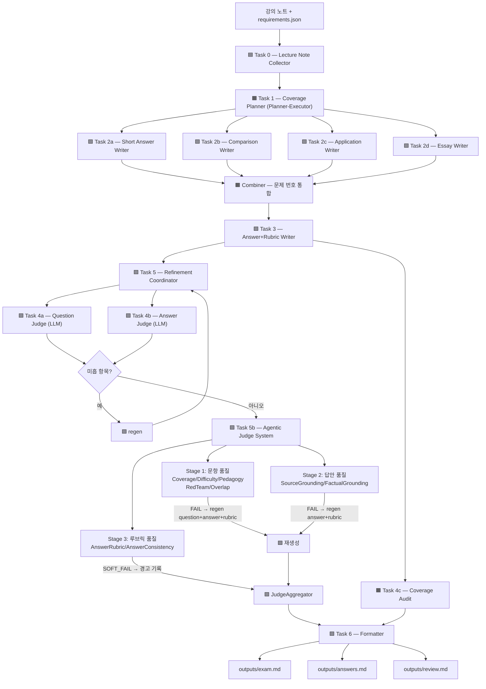

# Automated Exam Generation — Scientific Management HW #2

> **이 README는 AI Agent 프로그래밍을 처음 접하는 독자를 위해 작성되었습니다.**
> 코드를 보기 전에 이 문서를 끝까지 읽으면 시스템 전체 흐름을 이해할 수 있습니다.

---

## 1. 이 프로젝트가 하는 일

이 시스템은 **과학적 관리론 중간고사 시험지를 자동으로 만들어 주는 LLM 기반 에이전트 파이프라인**입니다.

강의 슬라이드 PDF 파일들을 입력으로 넣으면, 시스템이 스스로:

1. 강의 내용을 읽고 파악한다
2. 어떤 주제에서 몇 점 분량의 문제를 낼지 계획한다
3. 문제 유형별(단답형·비교형·적용형·서술형)로 문제를 동시에 작성한다
4. 강의 컨텍스트에 기반해 각 문제에 대한 모범 답안과 루브릭을 작성한다
5. **3단계 전문가 심사** 시스템이 문제·답안·루브릭을 독립적으로 평가한다
6. 미흡한 항목을 stage별로 정밀하게 재작성한다 (문항 문제 → 문항 재생성 / 답안 문제 → 답안+루브릭 재작성 / 루브릭 문제 → 루브릭만 재작성)
7. 최종 시험지·정답지·검토 보고서를 파일로 저장한다

사람이 직접 해야 하는 일은 전체의 약 15–20%로, "최종 범위 확인", "공정성 검토", "배점 승인" 단계만 남겨 두었습니다.

---

## 2. AI 에이전트(Agent)란?

> 이 섹션은 AI Agent 개념이 처음인 독자를 위한 배경 설명입니다. 이미 알고 있다면 3번으로 넘어가세요.

**에이전트(Agent)** 란 LLM(대형 언어 모델)에 "도구"와 "역할"을 부여해 특정 임무를 자율적으로 수행하게 만든 프로그램 단위입니다.

| 일반 LLM 사용 | 에이전트 사용 |
|---|---|
| 사람이 매번 프롬프트를 입력한다 | 에이전트가 스스로 다음 단계를 결정한다 |
| 한 번에 하나의 질문에 답한다 | 여러 도구를 순서대로 호출해 복잡한 작업을 완료한다 |
| 이전 대화 맥락이 금방 사라진다 | 메모리·데이터베이스를 통해 정보를 유지한다 |

이 프로젝트는 **13개의 에이전트**가 조립 라인처럼 협력하여 시험지를 만들어 냅니다. 각 에이전트는 정해진 역할(Task)만 담당하고, 결과물을 다음 에이전트에게 넘겨 줍니다.

---

## 3. 시스템 구조 한눈에 보기

```
lecture_notes/raw/*.pdf   (입력: 강의 슬라이드)
        │
        ▼  [scripts/extract_pdf_text.py]
lecture_notes/processed/*.txt   (텍스트 추출 완료)
        │
        ▼  [src/main.py — 13개 에이전트 파이프라인]
        │
        ├── Task 0  LectureNoteCollectorAgent   강의 내용 수집·등록
        ├── Task 1  CoveragePlannerAgent         출제 계획 수립
        ├── Task 2  (4개 에이전트 병렬 실행)
        │    ├── ShortAnswerWriterAgent          단답형 문제 작성
        │    ├── ComparisonWriterAgent           비교형 문제 작성
        │    ├── ApplicationWriterAgent          적용형 문제 작성
        │    └── EssayWriterAgent               서술형 문제 작성
        ├── Task 3  AnswerWriterAgent            모범 답안·루브릭 작성
        ├── Task 4a QuestionJudgeAgent           문제 품질 심사 (LLM)
        ├── Task 4b AnswerJudgeAgent             답안 품질 심사 (LLM)
        ├── Task 4c CoverageAuditAgent           범위·배점 검증 (결정론적)
        ├── Task 5  RefinementCoordinator        미흡 항목 재작성 루프
        ├── Task 5b AgenticJudgeSystemAgent      3단계 전문가 심사 시스템
        │    ├── [Stage 1 — 문항 품질]
        │    │    ├── CoverageJudgeAgent
        │    │    ├── DifficultyBalanceJudgeAgent
        │    │    ├── PedagogicalQualityJudgeAgent
        │    │    ├── RedTeamJudgeAgent
        │    │    └── OverlapJudgeAgent
        │    ├── [Stage 2 — 답안 품질]
        │    │    ├── SourceGroundingJudgeAgent
        │    │    └── FactualGroundingJudgeAgent
        │    ├── [Stage 3 — 루브릭 품질]
        │    │    ├── AnswerRubricJudgeAgent
        │    │    └── AnswerConsistencyJudgeAgent
        │    └── JudgeAggregatorAgent
        └── Task 6  FormatterAgent              최종 파일 출력
                │
                ▼
        outputs/exam.md        (학생용 시험지)
        outputs/answers.md     (강사용 정답지+루브릭)
        outputs/review.md      (심사 보고서)
```

---

## 4. 에이전트 흐름도 (APD)


```mermaid
flowchart TD
    INPUT["강의 노트 + requirements.json"] --> T0["🟦 Task 0 — Lecture Note Collector"]
    T0 --> T1["🟧 Task 1 — Coverage Planner (Planner-Executor)"]

    T1 --> T2A["🟩 Task 2a — Short Answer Writer"]
    T1 --> T2B["🟩 Task 2b — Comparison Writer"]
    T1 --> T2C["🟩 Task 2c — Application Writer"]
    T1 --> T2D["🟩 Task 2d — Essay Writer"]

    T2A --> COMBINE["🟧 Combiner — 문제 번호 통합"]
    T2B --> COMBINE
    T2C --> COMBINE
    T2D --> COMBINE

    COMBINE --> T3["🟩 Task 3 — Answer+Rubric Writer"]
    T3 --> T4C["🟧 Task 4c — Coverage Audit"]
    T3 --> T5["🟪 Task 5 — Refinement Coordinator"]

    T5 --> T4A["🟪 Task 4a — Question Judge (LLM)"]
    T5 --> T4B["🟪 Task 4b — Answer Judge (LLM)"]
    T4A --> LOOP{미흡 항목?}
    T4B --> LOOP
    LOOP -- "예" --> REGEN["🟩 regen"]
    REGEN --> T5
    LOOP -- "아니오" --> T5B["🟪 Task 5b — Agentic Judge System"]

    T5B --> S1["Stage 1: 문항 품질\nCoverage/Difficulty/Pedagogy\nRedTeam/Overlap"]
    T5B --> S2["Stage 2: 답안 품질\nSourceGrounding/FactualGrounding"]
    T5B --> S3["Stage 3: 루브릭 품질\nAnswerRubric/AnswerConsistency"]

    S1 -- "FAIL → regen question+answer+rubric" --> REGEN2["🟩 재생성"]
    S2 -- "FAIL → regen answer+rubric" --> REGEN2
    S3 -- "SOFT_FAIL → 경고 기록" --> AGG
    REGEN2 --> AGG["🟪 JudgeAggregator"]
    AGG --> T6["🟩 Task 6 — Formatter"]
    T4C --> T6

    T6 --> EXAM["outputs/exam.md"]
    T6 --> ANS["outputs/answers.md"]
    T6 --> REV["outputs/review.md"]
```

---

## 5. 3단계 전문가 심사 시스템 (AgenticJudgeSystemAgent)

핵심 설계 원칙: **문항·답안·루브릭은 논리적 의존관계가 있으므로 단계별로 심사하고 단계별로 최소 범위만 재생성합니다.**

```
Stage 1 (문항 품질) FAIL → 문항 + 답안 + 루브릭 전부 재생성
Stage 2 (답안 품질) FAIL → 강의 컨텍스트로 답안+루브릭 함께 재작성
Stage 3 (루브릭 품질) SOFT_FAIL → 경고 기록, human review로 위임
```

| 심사 에이전트 | Stage | 담당 | 판정 |
|---|---|---|---|
| `CoverageJudgeAgent` | 1 | 배점 합계·토픽 가중치 | HARD/SOFT_FAIL |
| `DifficultyBalanceJudgeAgent` | 1 | 난이도 분포 (tolerance ±10pt) | SOFT_FAIL |
| `PedagogicalQualityJudgeAgent` | 1 | 학습목표·고차원 인지·강의 특화 용어 | SOFT_FAIL |
| `RedTeamJudgeAgent` | 1 | 학생 관점 모호성·장황함 (임계값 90단어) | SOFT_FAIL |
| `OverlapJudgeAgent` | 1 | 문항 간 개념 겹침 (Jaccard **0.40** + LLM 배치 확인) | SOFT_FAIL |
| `SourceGroundingJudgeAgent` | 2 | 강의 출처 존재·어휘 검증 | HARD/SOFT_FAIL |
| `FactualGroundingJudgeAgent` | 2 | 모범답안 사실 오류 (의미적 검증) | 경고만 |
| `AnswerRubricJudgeAgent` | 3 | 답안 길이·루브릭 개수 | HARD/SOFT_FAIL |
| `AnswerConsistencyJudgeAgent` | 3 | 답안-루브릭 의미적 일치 | 경고만 |

#### 심사 기준 설계 근거

| 에이전트 | 핵심 임계값 | 설계 근거 |
|---------|------------|---------|
| `CoverageJudgeAgent` | HARD_FAIL ±20pt, SOFT_FAIL ±10pt | 20pt 초과 편차는 교육적으로 치명적; 10pt는 에이전트 계획 오차 허용 |
| `DifficultyBalanceJudgeAgent` | tolerance=10pt | 배점 단위 5/10/15/20pt에서 단답형 1문항 오분류 = 5pt 이동. 10pt 허용으로 경미한 라벨 오차 수용 |
| `PedagogicalQualityJudgeAgent` | lecture_terms 30개 (TF-IDF + fallback 합집합) | 수작업 9개 키워드는 오탐 많음. 실제 강의 노트에서 TF-IDF 상위 15개 + 고유명사 fallback 16개를 합산 |
| `RedTeamJudgeAgent` | overlong_prompt >90단어 (Essay 제외) | Application/Comparison 문항은 시나리오 서술에 70–85단어가 자연스러움. 70단어 임계값은 정상 문항도 오탐 |
| `AnswerConsistencyJudgeAgent` | SOFT_FAIL (경고만) | `write_answer_and_rubric()`으로 답안+루브릭이 함께 생성되면 일치성은 보장됨. HARD_FAIL은 무한 루프 유발 |
| `FactualGroundingJudgeAgent` | SOFT_FAIL (경고만) | 2500자 excerpt 한계로 정상 paraphrase도 "미확인"으로 분류될 수 있음. human review가 적절 |
| `SourceGroundingJudgeAgent` | source_refs 없음 → HARD_FAIL | 강의 근거 없는 문항은 할루시네이션 위험 |

---

## 6. 에이전트별 상세 설명

### Task 0 — LectureNoteCollectorAgent
**역할**: `lecture_notes/processed/` 폴더의 텍스트 파일을 읽어 에이전트 파이프라인에 전달합니다.

- 이미 처리된 파일은 JSON DB(`outputs/processed_notes_db.json`)로 중복 처리를 방지합니다.
- **TF-IDF 강의 용어 추출**: 강의 노트에서 과목 특화 용어 30개를 자동 추출해 `PedagogicalQualityJudgeAgent`에 전달합니다.
- **패턴**: Application Collector + JSON Database (강의 M5.3.2)

---

### Task 1 — CoveragePlannerAgent
**역할**: 강의 내용과 `requirements.json`을 분석해 "어떤 주제에서 몇 점 분량의 문제를 낼 것인가"를 담은 JSON 계획을 작성합니다. `build_question_slots()`로 문제 작성 전에 배점·토픽·난이도를 확정합니다.

- **패턴**: Planner-Executor (강의 M5.3.3)

---

### Task 2 — 문제 작성 에이전트 (4개 병렬 실행)

| Task | 에이전트 | 문제 유형 | 배점 |
|------|---------|----------|------|
| 2a | `ShortAnswerWriterAgent`  | 단답형 | 각 5점 × 6문제 |
| 2b | `ComparisonWriterAgent`   | 비교형 | 각 10점 × 2문제 |
| 2c | `ApplicationWriterAgent`  | 적용형 | 각 15점 × 2문제 |
| 2d | `EssayWriterAgent`        | 서술형 | 20점 × 1문제 |

LLM provider에 `batch_write_questions()` 메서드가 있으면 토픽 전체를 **단일 API 호출**로 처리합니다 (기본 20회 → 4회 절감).

**루브릭 일관성 제약**: 문제·답안·루브릭을 동시에 생성할 때, 프롬프트에 "답안을 먼저 작성하고, 루브릭은 그 답안에서 파생시켜라"는 제약을 명시합니다.

- **패턴**: Specialist Parallel Fan-out (강의 M5.3.3)

---

### Task 3 — AnswerWriterAgent
**역할**: `search_lecture_notes()` 도구로 강의 자료에서 근거를 찾아 `source_refs`에 기록합니다. Task 2의 batch writer가 이미 답안과 source_refs를 채워넣었다면 추가 API 호출 없이 건너뜁니다.

- **패턴**: ReAct-inspired Retrieval Tool (강의 M5.3.1.2 §8 + M5.3.2)

---

### Task 4a — QuestionJudgeAgent
**역할**: 작성된 문제를 4개 항목으로 LLM이 채점합니다.

| 항목 | 설명 | 만점 |
|------|------|------|
| `scope_alignment` | 강의 범위와 일치하는가 | 5점 |
| `difficulty_appropriateness` | 난이도가 적절한가 | 5점 |
| `clarity_no_ambiguity` | 문제가 명확한가 | 5점 |
| `answerable_from_lecture` | 강의 내용으로 풀 수 있는가 | 5점 |

총점 기준: **17점 이상 GOOD**, **13~16점 ACCEPTABLE**, **12점 이하 POOR** (만점 20점)

`batch_judge_questions()`로 11문항 전체를 **1회 호출**로 처리합니다.

- **패턴**: LLM-as-Judge with JSON Rubric (강의 M5.3.4)

---

### Task 4b — AnswerJudgeAgent

| 항목 | 설명 | 만점 |
|------|------|------|
| `factual_accuracy` | 내용이 정확한가 | 5점 |
| `completeness` | 핵심 내용이 빠짐없이 포함되었는가 | 5점 |
| `lecture_grounded` | 강의 자료에 근거했는가 | 5점 |
| `concise_pedagogical` | 간결하고 교육적으로 적절한가 | 5점 |

총점 기준: **17점 이상 GOOD**, **13~16점 ACCEPTABLE**, **12점 이하 POOR** (만점 20점)

- **패턴**: LLM-as-Judge with JSON Rubric (강의 M5.3.4)

---

### Task 5 — RefinementCoordinator
**역할**: Task 4a·4b의 심사 결과를 종합하고, POOR 판정을 받은 문제·답안을 재작성합니다. 최대 2회 반복합니다.

- **패턴**: Supervisor-Evaluator Reflection Loop (강의 M5.3.3)

---

### Task 5b — AgenticJudgeSystemAgent
**역할**: 9개의 전문 심사 에이전트가 3단계로 구조화된 심사를 수행합니다.

- Stage 1 문제 발견 → 문항+답안+루브릭 전체 재생성
- Stage 2 문제 발견 → `write_answer_and_rubric()`: 강의 컨텍스트로 답안 재작성 후 루브릭 파생
- Stage 3 문제 발견 → SOFT_FAIL 경고 기록, human review로 위임

- **패턴**: Agentic Judge Closed Loop (강의 M5.3.4)

---

### Task 6 — FormatterAgent
**역할**: 지금까지 만들어진 데이터를 파일로 저장합니다.

| 파일 | 내용 |
|------|------|
| `outputs/exam.md` | 학생용 시험지 (메타데이터 없이 문제만) |
| `outputs/answers.md` | 강사용 정답지 (문제 + 모범 답안 + 루브릭 + 출처) |
| `outputs/review.md` | 심사 보고서 |

---

## 7. 데이터 흐름 요약

```
[입력]
  lecture_notes/raw/*.pdf
        │ scripts/extract_pdf_text.py
        ▼
  lecture_notes/processed/*.txt
        │ Task 0: LectureNoteCollectorAgent + TF-IDF 용어 추출
        ▼
  notes{filename: text}, lecture_terms[]
        │ Task 1: CoveragePlannerAgent + build_question_slots()
        ▼
  question_slots[] (배점·토픽·난이도 사전 확정)
        │ Task 2: 4개 에이전트 병렬 실행 (batch_write_questions)
        ▼
  questions[] (prompt + answer + rubric + source_refs)
        │ Task 3: AnswerWriterAgent (source_refs 검증·보완)
        │ Task 4c: CoverageAuditAgent (결정론적)
        │ Task 5: RefinementCoordinator (1차 LLM judge 루프)
        │ Task 5b: AgenticJudgeSystemAgent (3단계 전문 심사)
        ▼
  refined_questions[]
        │ Task 6: FormatterAgent
        ▼
[출력]
  outputs/exam.md
  outputs/answers.md
  outputs/review.md
  outputs/agentic_judge_report.json
  outputs/assessment_validity_report.md
  outputs/human_review_checklist.md
  outputs/cost_report.json
  outputs/run_trace.json
```

---

## 8. 메모리 전략

| 층위 | 설명 | 이 프로젝트에서 |
|------|------|----------------|
| LLM 가중치 | Taylor·Gilbreth 등 도메인 지식 | Gemini 모델 자체 |
| 단기 기억 | 같은 주제 문제 중복 방지 | `seen_prompts` set |
| 장기 기억 | 처리된 강의 파일 목록 | `outputs/processed_notes_db.json` |
| 검색(RAG) | 강의 노트 키워드 검색 | `search_lecture_notes()` |

---

## 9. 출제 요건 설정 (`requirements.json`)

```json
{
  "course": "Scientific Management",
  "exam_name": "Midterm Exam",
  "language": "English",
  "target_duration_minutes": 75,
  "question_mix": {
    "short_answer": 6,
    "concept_comparison": 2,
    "application": 2,
    "essay": 1
  },
  "coverage_weights": {
    "work_and_work_systems":        25,
    "scientific_management":        20,
    "problem_solving_and_ideation": 25,
    "innovation_frameworks":        15,
    "motion_study_and_therbligs":   15
  },
  "difficulty": {
    "easy": 25,
    "medium": 50,
    "hard": 25
  }
}
```

---

## 10. 프로젝트 파일 구조

```
exam-agent-project/
│
├── requirements.json            # 출제 기준 (문제 수, 배점, 주제 비중)
├── model_policy.json            # 모델 선택 정책 (provider·quality별)
├── exam_blueprint.json          # 사전 확정 문제 세트 (선택 사용)
│
├── lecture_notes/
│   ├── raw/                     # 원본 강의 PDF
│   └── processed/               # 텍스트 추출 완료 (.txt)
│
├── scripts/
│   ├── extract_pdf_text.py      # PDF → 텍스트 변환
│   ├── ingest_materials.py      # 다양한 입력 형식 처리
│   └── doctor.py               # 실행 전 환경 점검
│
├── src/
│   ├── main.py                  # 파이프라인 진입점 + CLI
│   ├── agents.py                # 13개 에이전트 + 9개 judge 클래스
│   ├── providers.py             # LLM 제공자 (Gemini/OpenAI/Anthropic/Deterministic)
│   ├── costing.py               # 토큰 사용량·비용 추적
│   └── evaluation.py           # 독립 평가 하네스
│
├── outputs/                     # 생성된 결과물 (자동 생성)
│   ├── exam.md                  # 학생용 시험지
│   ├── answers.md               # 강사용 정답지
│   ├── review.md                # 심사 보고서
│   ├── agentic_judge_report.json
│   ├── assessment_validity_report.md
│   ├── human_review_checklist.md
│   ├── cost_report.json
│   └── run_trace.json
│
└── docs/
    ├── report_draft.md          # 보고서 초안
    └── scope.md                 # 시험 범위 요약
```

---

## 11. 빠른 시작 (Quick Start)

### 사전 준비

```bash
pip install pypdf google-genai    # PDF 추출 + Gemini (필수)
# pip install openai               # OpenAI 사용 시
# pip install anthropic            # Anthropic 사용 시
```

### Step 1. 강의 자료 준비

PDF 강의 슬라이드를 `lecture_notes/raw/` 폴더에 넣습니다.

### Step 2. PDF에서 텍스트 추출

```bash
python scripts/extract_pdf_text.py
```

### Step 3. 환경 점검

```bash
python scripts/doctor.py
```

### Step 4. 시험 생성

```bash
# 결정론적 모드 (API 키 불필요, 테스트용)
python src/main.py

# Gemini API 키 모드 (실제 LLM)
set GEMINI_API_KEY=your-api-key
python src/main.py --provider gemini --quality final_low_cost --strict-provider --blueprint nonexistent

# Vertex AI 모드 (GCP)
set GCP_PROJECT_ID=your-project-id
python src/main.py --provider vertex --quality final --strict-provider --blueprint nonexistent
```

---

## 12. 실행 모드

| 모드 | 명령어 | 특징 |
|------|--------|------|
| 결정론적 (기본) | `python src/main.py` | API 키 불필요, 파이프라인 구조 테스트용 |
| Gemini API 키 | `--provider gemini` | Google AI Studio 무료/유료 티어 |
| Vertex AI | `--provider vertex` | GCP 프로젝트, 강의 M5.3.1.1 패턴 |
| OpenAI | `--provider openai` | `OPENAI_API_KEY` 필요 |
| Anthropic | `--provider anthropic` | `ANTHROPIC_API_KEY` 필요 |

---

## 13. 주요 CLI 옵션

```bash
python src/main.py [옵션]

  --provider        LLM 제공자 (기본: deterministic)
  --quality         품질 설정: draft | final | final_low_cost
  --strict-provider provider 실패 시 fallback 없이 중단
  --blueprint       사전 확정 문제 파일 경로 (nonexistent 지정 시 LLM 생성)
  --resume-from-judge   outputs/questions.json 로드 후 judge만 재실행
  --regen-questions Q_NUMS  특정 문항만 재생성 (예: "2,6")
  --max-refine      1차 judge 루프 최대 반복 횟수 (기본: 2)
  --max-agentic-judge-refine  2차 judge 루프 최대 반복 횟수 (기본: 2)
  --batch-judge     QuestionJudge/AnswerJudge를 11문항 일괄 호출 1회로 처리 (자동 활성화)
  --model-preset    모델 사전 설정 (lecture_flash|cheap|balanced|pro|gpt|claude_opus 등)
```

---

## 14. 사람이 개입해야 하는 지점 (Human-in-the-Loop)

이 시스템은 시험 생성의 약 80–85%를 자동화하지만, 다음은 반드시 사람이 확인해야 합니다.

1. **범위 확인**: 생성된 문항이 실제 시험 범위에 포함되는지 교수님께 확인
2. **공정성 검토**: `outputs/human_review_checklist.md` 항목별 체크
3. **사실 오류 경고 검토**: `outputs/agentic_judge_report.json`의 `FactualGroundingJudge` 경고 확인
4. **루브릭 일관성 검토**: `AnswerConsistencyJudge` 경고가 있는 문항 확인
5. **최종 배점 확정**: 자동 생성된 배점은 참고용

---

## 15. 에이전트 패턴과 강의 매핑

| 구현된 패턴 | 강의 참조 | 이 프로젝트에서 |
|------------|---------|----------------|
| `BaseAgentWorker` 인터페이스 | M5.3.1.2 §11 | `src/agents.py` 모든 에이전트의 기반 클래스 |
| Local tools + JSON DB | M5.3.2 ApplicationCollector | `LectureNoteCollectorAgent` |
| Planner-Executor | M5.3.3 `plan_and_accept` | `CoveragePlannerAgent` → Writers |
| Parallel Fan-out | M5.3.3 `parallel_screening` | `ThreadPoolExecutor`로 4개 Writer 동시 실행 |
| ReAct + Retrieval | M5.3.1.2 §8 + M5.3.2 | `AnswerWriterAgent` + `search_lecture_notes` |
| LLM-as-Judge JSON Rubric | M5.3.4 | `QuestionJudgeAgent`, `AnswerJudgeAgent` |
| Supervisor-Evaluator Loop | M5.3.3 reflective | `RefinementCoordinator` |
| Agentic Judge Closed Loop | M5.3.4 | `AgenticJudgeSystemAgent` (3단계 9개 judge) |
| 3-method Evaluation | M5.3.4 §3-method matrix | `src/evaluation.py` |

---

## 16. 자주 묻는 질문

**Q. API 키 없이도 실행됩니까?**
A. 예. 기본 모드(deterministic)는 API 키 없이 실행됩니다. 파이프라인 전체 흐름을 테스트할 수 있지만, 실제 LLM 창의적 문제 생성은 하지 않습니다.

**Q. `--resume-from-judge`는 언제 씁니까?**
A. judge 에이전트가 추가·수정된 후 기존 문항을 다시 심사할 때 씁니다. `outputs/questions.json`을 그대로 유지하면서 judge + formatter만 재실행합니다.

**Q. `--regen-questions 2,6`은 언제 씁니까?**
A. 특정 문항만 품질이 미흡하거나 겹침이 발견되어 해당 문항만 재생성할 때 씁니다. LLM provider가 그 문항에 대해서만 `regen_question + regen_answer_and_rubric`을 실행합니다.

**Q. gemini-2.5-flash 무료 한도는 얼마입니까?**
A. 결제 미활성화 시 20 RPD(하루 20회). 이 파이프라인은 전체 실행에 약 7회를 사용합니다. 결제 활성화 시 한도가 크게 높아집니다.

**Q. 문제 수나 배점을 바꾸려면?**
A. `requirements.json`의 `question_mix`와 `coverage_weights`를 수정하세요. 코드 변경 없이 적용됩니다.

---

## 17. 실제 실행 결과 (최신 LLM 산출물)

현재 `outputs/` 폴더는 Gemini API 키 모드로 생성된 실제 LLM 결과물입니다.

### 생성된 시험지 구성

| 번호 | 유형 | 주제 | 배점 | 난이도 |
|---|---|---|---|---|
| Q1 | Short Answer | Work and Work Systems | 5점 | Easy |
| Q2 | Short Answer | Problem Solving and Ideation | 5점 | Easy |
| Q3 | Short Answer | Work and Work Systems | 5점 | Easy |
| Q4 | Short Answer | Work and Work Systems | 5점 | Easy |
| Q5 | Short Answer | Scientific Management | 5점 | Easy |
| Q6 | Short Answer | Problem Solving and Ideation | 5점 | Hard |
| Q7 | Concept Comparison | Work and Work Systems (Taxonomy) | 10점 | Medium |
| Q8 | Concept Comparison | Problem Solving and Ideation | 10점 | Medium |
| Q9 | Application | Innovation Frameworks | 15점 | Medium |
| Q10 | Application | Motion Study and Therbligs | 15점 | Medium |
| Q11 | Essay | Scientific Management | 20점 | Hard |

### 품질 평가 결과

| 항목 | 값 |
|---|---|
| AgenticJudge 최종 판정 | **PASS** (12/12 targets) |
| Coverage 검증 | 5개 토픽 모두 delta=0 |
| 난이도 분포 | Easy:25 / Medium:50 / Hard:25 (정확 일치) |
| 예상 시험 시간 | 75분 (목표 내) |
| 고차원 인지 비율 | 45.5% (Analyze/Apply/Evaluate 포함) |
