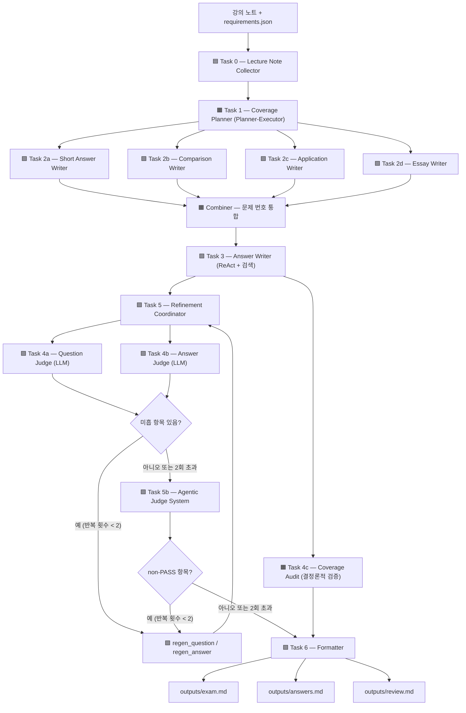

# Automated Exam Generation — Scientific Management HW #2

> **이 README는 AI Agent 프로그래밍을 처음 접하는 독자를 위해 작성되었습니다.**
> 코드를 보기 전에 이 문서를 끝까지 읽으면 시스템 전체 흐름을 이해할 수 있습니다.

---

## 1. 이 프로젝트가 하는 일

이 시스템은 **과학적 관리론 중간고사 시험지를 자동으로 만들어 주는 LLM 기반 에이전트 파이프라인**입니다.

강의 슬라이드 PDF 파일들을 입력으로 넣으면, 시스템이 스스로:

1. 강의 내용을 읽고 파악한다
2. 어떤 주제에서 몇 점 분량의 문제를 낼지 계획한다
3. 문제 유형별(단답형·비교형·적용형·서술형)로 문제를 동시에 작성한다
4. 각 문제에 대한 모범 답안을 작성한다
5. 문제와 답안의 품질을 LLM 심사관이 평가하고 미흡 항목을 재작성한다
6. 최종 시험지·정답지·검토 보고서를 파일로 저장한다

사람이 직접 해야 하는 일은 전체의 약 20%로, "최종 범위 확인", "공정성 검토", "배점 승인" 단계만 남겨 두었습니다.

---

## 2. AI 에이전트(Agent)란?

> 이 섹션은 AI Agent 개념이 처음인 독자를 위한 배경 설명입니다. 이미 알고 있다면 3번으로 넘어가세요.

**에이전트(Agent)** 란 LLM(대형 언어 모델)에 "도구"와 "역할"을 부여해 특정 임무를 자율적으로 수행하게 만든 프로그램 단위입니다.

| 일반 LLM 사용 | 에이전트 사용 |
|---|---|
| 사람이 매번 프롬프트를 입력한다 | 에이전트가 스스로 다음 단계를 결정한다 |
| 한 번에 하나의 질문에 답한다 | 여러 도구를 순서대로 호출해 복잡한 작업을 완료한다 |
| 이전 대화 맥락이 금방 사라진다 | 메모리·데이터베이스를 통해 정보를 유지한다 |

이 프로젝트는 **13개의 에이전트**가 조립 라인처럼 협력하여 시험지를 만들어 냅니다. 각 에이전트는 정해진 역할(Task)만 담당하고, 결과물을 다음 에이전트에게 넘겨 줍니다.

---

## 3. 시스템 구조 한눈에 보기

```
lecture_notes/raw/*.pdf   (입력: 강의 슬라이드)
        │
        ▼  [scripts/extract_pdf_text.py]
lecture_notes/processed/*.txt   (텍스트 추출 완료)
        │
        ▼  [src/main.py — 13개 에이전트 파이프라인]
        │
        ├── Task 0  LectureNoteCollectorAgent   강의 내용 수집·등록
        ├── Task 1  CoveragePlannerAgent         출제 계획 수립
        ├── Task 2  (4개 에이전트 병렬 실행)
        │    ├── ShortAnswerWriterAgent          단답형 문제 작성
        │    ├── ComparisonWriterAgent           비교형 문제 작성
        │    ├── ApplicationWriterAgent          적용형 문제 작성
        │    └── EssayWriterAgent               서술형 문제 작성
        ├── Task 3  AnswerWriterAgent            모범 답안 작성
        ├── Task 4a QuestionJudgeAgent           문제 품질 심사 (LLM)
        ├── Task 4b AnswerJudgeAgent             답안 품질 심사 (LLM)
        ├── Task 4c CoverageAuditAgent           범위·배점 검증 (결정론적)
        ├── Task 5  RefinementCoordinator        미흡 항목 재작성 루프
        ├── Task 5b AgenticJudgeSystemAgent      전문가 에이전트 2차 심사
        │    ├── CoverageJudgeAgent
        │    ├── SourceGroundingJudgeAgent
        │    ├── DifficultyBalanceJudgeAgent
        │    ├── PedagogicalQualityJudgeAgent
        │    ├── AnswerRubricJudgeAgent
        │    ├── RedTeamJudgeAgent
        │    └── JudgeAggregatorAgent
        └── Task 6  FormatterAgent              최종 파일 출력
                │
                ▼
        outputs/exam.md        (시험지)
        outputs/answers.md     (정답지)
        outputs/review.md      (심사 보고서)
```

---

## 4. 에이전트 흐름도 (APD)

아래 다이어그램은 각 Task의 실행 순서와 분기를 보여 줍니다.
색상은 강의 규약을 따릅니다: 🟦 정보 수집 / 🟧 정보 분석 / 🟪 의사결정 / 🟩 실행


```mermaid
flowchart TD
    INPUT["강의 노트 + requirements.json"] --> T0["🟦 Task 0 — Lecture Note Collector"]
    T0 --> T1["🟧 Task 1 — Coverage Planner (Planner-Executor)"]

    T1 --> T2A["🟩 Task 2a — Short Answer Writer"]
    T1 --> T2B["🟩 Task 2b — Comparison Writer"]
    T1 --> T2C["🟩 Task 2c — Application Writer"]
    T1 --> T2D["🟩 Task 2d — Essay Writer"]

    T2A --> COMBINE["🟧 Combiner — 문제 번호 통합"]
    T2B --> COMBINE
    T2C --> COMBINE
    T2D --> COMBINE

    COMBINE --> T3["🟩 Task 3 — Answer Writer (ReAct + 검색)"]
    T3 --> T4C["🟧 Task 4c — Coverage Audit (결정론적 검증)"]
    T3 --> T5["🟪 Task 5 — Refinement Coordinator"]

    T5 --> T4A["🟪 Task 4a — Question Judge (LLM)"]
    T5 --> T4B["🟪 Task 4b — Answer Judge (LLM)"]
    T4A --> LOOP{미흡 항목 있음?}
    T4B --> LOOP
    LOOP -- "예 (반복 횟수 < 2)" --> REGEN["🟩 regen_question / regen_answer"]
    REGEN --> T5
    LOOP -- "아니오 또는 2회 초과" --> T5B["🟪 Task 5b — Agentic Judge System"]
    T5B --> LOOP2{non-PASS 항목?}
    LOOP2 -- "예 (반복 횟수 < 2)" --> REGEN
    LOOP2 -- "아니오 또는 2회 초과" --> T6["🟩 Task 6 — Formatter"]
    T4C --> T6

    T6 --> EXAM["outputs/exam.md"]
    T6 --> ANS["outputs/answers.md"]
    T6 --> REV["outputs/review.md"]
```

---

## 5. 에이전트별 상세 설명

### Task 0 — LectureNoteCollectorAgent
**역할**: `lecture_notes/processed/` 폴더의 텍스트 파일을 읽어 에이전트 파이프라인에 전달합니다.

- 이미 처리된 파일은 JSON DB(`outputs/processed_notes_db.json`)로 중복 처리를 방지합니다.
- **패턴**: Application Collector + JSON Database (강의 M5.3.2)

---

### Task 1 — CoveragePlannerAgent
**역할**: 강의 내용과 `requirements.json`을 분석해 "어떤 주제에서 몇 점 분량의 문제를 낼 것인가"를 담은 JSON 계획을 작성합니다.

```json
[
  {"key": "work_and_work_systems", "title": "일과 작업 시스템", "weight": 25, "keywords": ["work system", "emergence"]},
  {"key": "scientific_management",  "title": "과학적 관리",     "weight": 20, "keywords": ["Taylor", "soldiering"]}
]
```

- **패턴**: Planner-Executor (강의 M5.3.3)

---

### Task 2 — 문제 작성 에이전트 (4개 병렬 실행)
**역할**: 4종류의 문제를 동시에 작성합니다. `ThreadPoolExecutor`로 병렬 실행됩니다.

| Task | 에이전트 | 문제 유형 | 배점 |
|------|---------|----------|------|
| 2a | `ShortAnswerWriterAgent`  | 단답형 — 정의, 열거 | 각 5점 × 6문제 |
| 2b | `ComparisonWriterAgent`   | 비교형 — 두 개념 대조 | 각 10점 × 2문제 |
| 2c | `ApplicationWriterAgent`  | 적용형 — 시나리오 분석 | 각 15점 × 2문제 |
| 2d | `EssayWriterAgent`        | 서술형 — 주제 통합 논술 | 20점 × 1문제 |

LLM provider에 `batch_write_questions()` 메서드가 있으면 토픽 전체를 **단일 API 호출**로 처리합니다 (기본 20회 → 4회 절감).

4개 에이전트의 출력은 Combiner가 합쳐 Q1~Q11로 번호를 통일합니다.

- **패턴**: Specialist Parallel Fan-out (강의 M5.3.3)

---

### Task 3 — AnswerWriterAgent
**역할**: 각 문제에 대한 모범 답안을 작성합니다. `search_lecture_notes()` 도구로 강의 자료에서 근거를 찾아 `source_refs`에 기록합니다.

Task 2의 batch writer가 이미 답안과 source_refs를 채워넣었다면 추가 API 호출 없이 건너뜁니다.

- **패턴**: ReAct-inspired Retrieval Tool (강의 M5.3.1.2 §8 + M5.3.2)

---

### Task 4a — QuestionJudgeAgent
**역할**: 작성된 문제를 4개 항목으로 LLM이 채점합니다.

| 항목 | 설명 | 만점 |
|------|------|------|
| `scope_alignment` | 강의 범위와 일치하는가 | 5점 |
| `difficulty_appropriateness` | 난이도가 적절한가 | 5점 |
| `clarity_no_ambiguity` | 문제가 명확한가 | 5점 |
| `answerable_from_lecture` | 강의 내용으로 풀 수 있는가 | 5점 |

총점 기준: **17점 이상 GOOD**, **13~16점 ACCEPTABLE**, **12점 이하 POOR**

`batch_judge_questions()`로 11문항 전체를 **1회 호출**로 처리합니다.

- **패턴**: LLM-as-Judge with JSON Rubric (강의 M5.3.4)

---

### Task 4b — AnswerJudgeAgent
**역할**: 작성된 모범 답안을 4개 항목으로 LLM이 채점합니다.

| 항목 | 설명 | 만점 |
|------|------|------|
| `factual_accuracy` | 내용이 정확한가 | 5점 |
| `completeness` | 핵심 내용이 빠짐없이 포함되었는가 | 5점 |
| `lecture_grounded` | 강의 자료에 근거했는가 | 5점 |
| `concise_pedagogical` | 간결하고 교육적으로 적절한가 | 5점 |

`batch_judge_answers()`로 11답안 전체를 **1회 호출**로 처리합니다.

- **패턴**: LLM-as-Judge with JSON Rubric (강의 M5.3.4)

---

### Task 4c — CoverageAuditAgent
**역할**: LLM 없이 규칙 기반으로 구조적 요건을 검증합니다. 실패하면 review.md에 경고를 기록합니다.

검증 항목:
- 전체 배점 합계 = 100점
- `requirements.json`에 지정된 주제가 모두 포함되었는가
- 문제 유형별 개수가 요건과 일치하는가

- **패턴**: Deterministic — LLM을 사용하지 않아 항상 같은 결과를 냅니다.

---

### Task 5 — RefinementCoordinator
**역할**: Task 4a·4b의 심사 결과를 종합하고, POOR 판정을 받은 문제·답안을 재작성합니다. 이 과정을 최대 2회 반복합니다.

```
[1회차 심사] → POOR 문제 발견 → judge의 suggestion을 프롬프트에 주입 → 해당 문제만 재작성
[2회차 심사] → 여전히 POOR이면 현재 상태 유지 (인간 검토로 넘김)
```

- **패턴**: Supervisor-Evaluator Reflection Loop (강의 M5.3.3)

---

### Task 5b — AgenticJudgeSystemAgent
**역할**: 6개의 전문 심사 에이전트가 각 문제를 독립적으로 평가한 뒤, JudgeAggregatorAgent가 결과를 종합합니다. PASS가 아닌 항목에 대해 `revision_instructions`를 생성하고 최대 2회 재작성 루프를 실행합니다.

| 전문 심사 에이전트 | 담당 | 판정 |
|---|---|---|
| `CoverageJudgeAgent` | 배점 합계·토픽 가중치 | HARD_FAIL |
| `SourceGroundingJudgeAgent` | 강의노트 출처 검증 | HARD_FAIL / SOFT_FAIL |
| `DifficultyBalanceJudgeAgent` | 난이도 분포 | SOFT_FAIL |
| `PedagogicalQualityJudgeAgent` | 학습목표·고차원 인지 | SOFT_FAIL |
| `AnswerRubricJudgeAgent` | 모범답안 충실도·루브릭 | HARD_FAIL / SOFT_FAIL |
| `RedTeamJudgeAgent` | 학생 관점 모호성·공정성 | SOFT_FAIL |

결과물: `outputs/agentic_judge_report.json`

- **패턴**: Agentic Judge with Closed Revision Loop (강의 M5.3.4)

---

### Task 6 — FormatterAgent
**역할**: 지금까지 만들어진 데이터를 파일로 저장합니다.

| 파일 | 내용 |
|------|------|
| `outputs/exam.md` | 수험생용 시험지 (문제만) |
| `outputs/answers.md` | 강사용 정답지 (문제 + 모범 답안 + 루브릭 + 출처) |
| `outputs/review.md` | 검토 보고서 (범위 감사 결과, 심사 점수, 재작성 이력) |

- **패턴**: Deterministic local tool (LLM 없이 문자열 조립)

---

## 6. 데이터 흐름 요약

```
[입력]
  lecture_notes/raw/*.pdf
        │ scripts/extract_pdf_text.py
        ▼
  lecture_notes/processed/*.txt
        │ Task 0: LectureNoteCollectorAgent
        ▼
  notes{filename: text}  ◄──── 이후 모든 에이전트가 참조
        │ Task 1: CoveragePlannerAgent (1회 LLM 호출)
        ▼
  topics[] (메모리 내 전달)
        │ Task 2: 4개 에이전트 병렬 실행 (4회 LLM 호출)
        ▼
  questions[] (prompt + answer + source_refs 포함)
        │ Task 3: AnswerWriterAgent (이미 채워진 경우 0회)
        ▼
  questions[] (source_refs 보완)
        │ Task 4c: CoverageAuditAgent (LLM 없음)
        │ Task 5: RefinementCoordinator → 4a, 4b (2회 LLM 호출)
        ▼
  refined_questions[], verdicts[]
        │ Task 5b: AgenticJudgeSystemAgent (LLM 없음, 결정론적)
        │ Task 6: FormatterAgent (LLM 없음)
        ▼
[출력]
  outputs/exam.md / answers.md / review.md
  outputs/agentic_judge_report.json
  outputs/assessment_validity_report.md
  outputs/cost_report.json / run_trace.json
```

---

## 7. 메모리 전략 (강의 M5.3.2)

| 층위 | 설명 | 이 프로젝트에서 |
|------|------|----------------|
| LLM 가중치(내재 지식) | Taylor·Gilbreth 등 도메인 지식은 LLM이 이미 학습으로 알고 있음 | Gemini Flash 모델 자체 |
| 단기 기억 (세션) | 같은 주제 문제가 중복되지 않도록 세션 내에서 유지 | writer fast-path의 seen_prompts set |
| 장기 기억 (JSON DB) | 처리된 강의 파일 목록 — 재실행 시 중복 처리 방지 | `outputs/processed_notes_db.json` |
| 단기 요약 | 강의 노트가 LLM 컨텍스트 길이를 초과할 때 요약 | MVP에서는 미사용, 확장 가능 |

---

## 8. 출제 요건 설정 (`requirements.json`)

```json
{
  "course": "Scientific Management",
  "exam_name": "Midterm Exam",
  "language": "English",
  "target_duration_minutes": 75,
  "question_mix": {
    "short_answer": 6,
    "concept_comparison": 2,
    "application": 2,
    "essay": 1
  },
  "coverage_weights": {
    "work_and_work_systems":        25,
    "scientific_management":        20,
    "problem_solving_and_ideation": 25,
    "innovation_frameworks":        15,
    "motion_study_and_therbligs":   15
  },
  "difficulty": {
    "easy": 25,
    "medium": 50,
    "hard": 25
  }
}
```

이 파일을 수정하면 시험 형식이 바뀝니다. 코드를 바꿀 필요 없습니다.

---

## 9. 프로젝트 파일 구조

```
exam-agent-project/
│
├── requirements.json            # 출제 기준 (문제 수, 배점, 주제 비중)
├── model_policy.json            # 모델 선택 정책 (quality profile, fallback chain)
│
├── lecture_notes/
│   ├── raw/                     # 원본 강의 PDF 파일
│   └── processed/               # 텍스트 추출 완료 파일
│
├── scripts/
│   ├── extract_pdf_text.py      # PDF → 텍스트 변환
│   ├── ingest_materials.py      # PDF/DOCX/PPTX/TXT 통합 처리
│   └── doctor.py                # 환경 설정 진단
│
├── src/
│   ├── main.py                  # 파이프라인 진입점
│   ├── agents.py                # 13개 에이전트 클래스 정의
│   ├── providers.py             # GeminiProvider, OpenAI, Anthropic, Deterministic
│   ├── evaluation.py            # 평가 하네스 (pilot test + LLM judge + simulation)
│   └── costing.py               # 토큰·비용 추적
│
├── prompts/
│   ├── system_prompt.md         # 에이전트 공통 시스템 프롬프트
│   └── reviewer_prompt.md       # 심사 에이전트 전용 프롬프트
│
├── outputs/                     # 실행 결과물 (자동 생성)
│   ├── exam.md                  # 시험지
│   ├── answers.md               # 정답지 + 루브릭
│   ├── review.md                # LLM 심사 보고서
│   ├── questions.json           # 문제 전체 데이터 (재실행·resume용)
│   ├── agentic_judge_report.json
│   ├── assessment_validity_report.md / .json
│   ├── residual_risk_report.json
│   ├── human_review_checklist.md
│   ├── cost_report.json         # API 호출 상세 기록
│   └── run_trace.json           # 파이프라인 실행 추적
│
└── docs/
    ├── architecture.md          # 시스템 설계 상세 문서
    ├── project_plan.md          # 프로젝트 계획
    └── scope.md                 # 시험 범위 요약
```

---

## 10. 빠른 시작 (Quick Start)

### 사전 준비

```bash
pip install pypdf google-genai
```

### Step 1. API 키 설정

```bash
# Windows CMD
set GEMINI_API_KEY=여기에_API_키_입력

# PowerShell
$env:GEMINI_API_KEY="여기에_API_키_입력"
```

Google AI Studio(https://aistudio.google.com/apikey)에서 무료 발급 가능합니다. 하루 20회 호출 한도 내에서 무료입니다.

### Step 2. 강의 자료 준비

PDF 강의 슬라이드를 `lecture_notes/raw/` 폴더에 넣습니다.

### Step 3. PDF에서 텍스트 추출

```bash
python scripts/extract_pdf_text.py
```

`lecture_notes/processed/` 폴더에 `.txt` 파일들이 생성됩니다.

### Step 4. 시험 생성

```bash
# LLM 전체 경로 (권장 — 7회 호출, ~$0.007)
python src/main.py --quality final_low_cost --strict-provider --max-refine 0 --max-agentic-judge-refine 0 --judge-model gemini-2.5-flash

# API 키 없이 파이프라인 구조만 테스트 (결정론적, 문제 은행 사용)
python src/main.py --provider deterministic
```

> **참고 — `exam_blueprint.json`**: 로컬에 이 파일이 있으면 Task 2의 LLM Writer가 우회되고 경고 메시지가 출력됩니다. 현재 제출 산출물(`outputs/`)은 blueprint 없이 전체 LLM 파이프라인으로 생성됐습니다 (`outputs/cost_report.json` 참조, 7회 호출, GeminiApiKeyProvider).

완료되면 `outputs/` 폴더에 결과물이 생성됩니다.

---

## 11. 실행 모드 (Provider)

에이전트 코드는 변경 없이 `src/providers.py`의 provider만 교체됩니다. `GEMINI_API_KEY` 환경변수가 설정되어 있으면 자동으로 `GeminiApiKeyProvider`가 선택됩니다.

### Gemini API 키 모드 (Google AI Studio, 무료 티어)

```bash
set GEMINI_API_KEY=your-key
python src/main.py --quality final_low_cost --strict-provider --max-refine 0 --max-agentic-judge-refine 0 --judge-model gemini-2.5-flash
```

- 무료 한도: 모델당 하루 20회(RPD), 분당 10회(RPM)
- `batch_write_questions` + `batch_judge` 자동 활성화로 전체 7회 호출에 완료 가능

### Vertex AI 모드 (GCP 강의 경로)

```bash
pip install google-genai
gcloud auth application-default login
set GCP_PROJECT_ID=your-project-id
python src/main.py --provider vertex --quality final_low_cost --strict-provider
```

### 결정론적 모드 (API 키 불필요, 구조 테스트용)

```bash
python src/main.py --provider deterministic
```

미리 작성된 문제 은행에서 문제를 선택합니다. LLM을 전혀 사용하지 않으며, 파이프라인 구조 확인 목적으로만 적합합니다.

### OpenAI / Anthropic 모드

```bash
# OpenAI
set OPENAI_API_KEY=your-key
python src/main.py --provider openai --quality final --model-preset gpt --strict-provider

# Anthropic
set ANTHROPIC_API_KEY=your-key
python src/main.py --provider anthropic --quality final --model-preset claude_opus --strict-provider
```

---

## 12. 명령줄 옵션

```
python src/main.py [옵션]

  --quality           품질 프로파일: draft | final | final_low_cost (기본: draft)
  --provider          LLM 제공자: deterministic | gemini | vertex | openai | anthropic
  --strict-provider   폴백 없이 LLM 실패 시 즉시 중단
  --max-refine        RefinementCoordinator 최대 반복 횟수 (기본: 2)
  --max-agentic-judge-refine  AgenticJudge 최대 반복 횟수 (기본: 2)
  --judge-model       judge 역할 모델 오버라이드 (예: gemini-2.5-flash)
  --planner-model     planner 역할 모델 오버라이드
  --writer-model      writer 역할 모델 오버라이드
  --answer-model      answer_writer 역할 모델 오버라이드
  --model-preset      model_policy.json에 정의된 프리셋 (lecture_flash, gpt, claude_opus 등)
  --resume-from-judge outputs/questions.json에서 로드해 judge 단계만 실행 (2회 호출)
  --batch-judge       수동으로 배치 judge 활성화 (기본: 자동 활성화)
  --blueprint         exam_blueprint.json 경로 (존재하지 않는 경로 지정 시 LLM writer 실행)
  --processed-dir     강의 텍스트 파일 폴더 (기본: lecture_notes/processed)
  --requirements      출제 기준 파일 경로 (기본: requirements.json)
  --outputs-dir       결과물 저장 폴더 (기본: outputs)
```

---

## 13. API 호출 최적화

전체 파이프라인을 무료 티어(하루 20회) 안에서 실행하기 위해 배치 API 호출을 구현했습니다.

| 단계 | 기존 | 최적화 후 |
|---|---|---|
| 플래너 | 1회 | 1회 |
| 문제 작성 (5토픽 × 4유형) | **20회** | **4회** (`batch_write_questions`) |
| 답안 작성 | **11회** | **0회** (writer가 함께 생성) |
| 문제·답안 심사 | **22회** | **2회** (`batch_judge_questions/answers`) |
| **합계** | **54회** | **7회** |

`batch_write_questions()`는 Gemini provider에만 구현되어 있습니다. 환경변수에서 provider가 자동 감지되므로 별도 플래그 없이 실행하면 됩니다.

---

## 14. 평가 실행

시스템 품질을 측정하는 별도의 평가 하네스가 있습니다. 강의 M5.3.4의 3-method matrix를 구현합니다.

```bash
python src/evaluation.py --provider gemini --quality final_low_cost --simulate-trials 1
```

**3가지 평가 방법:**

1. **Pilot Test (골든셋 테스트)**: 5개의 고정 테스트 케이스(Taylor 4원칙, DASSI 5단계 등)에 대해 기대 키워드가 포함되었는지 확인합니다.

2. **LLM-as-Judge**: `QuestionJudgeAgent` + `AnswerJudgeAgent`를 실행해 판정 분포(GOOD/ACCEPTABLE/POOR)와 평균 루브릭 점수를 집계합니다.

3. **Simulation**: 파이프라인을 N번 반복 실행해 평균 실행 시간과 비용을 측정합니다.

결과: `outputs/evaluation_report.json`

---

## 15. 사람이 개입해야 하는 지점 (Human-in-the-Loop)

이 시스템은 시험 생성의 약 80%를 자동화하지만, 다음 4가지는 반드시 사람이 확인해야 합니다.

1. **범위 확인**: M3.1.1 Therbligs가 실제 시험 범위에 포함되는지 교수님께 확인
2. **공정성 검토**: 생성된 문제가 편향 없이 공정한지, 교수님의 출제 스타일과 맞는지 확인
3. **재작성 한계 초과 항목**: 반복 후에도 미흡 판정이면 사람이 직접 수정
4. **최종 배점 확정**: 자동 생성된 배점은 참고용이며, 최종 배점은 교수가 승인

---

## 16. 에이전트 패턴과 강의 매핑

| 구현된 패턴 | 강의 참조 | 이 프로젝트에서 |
|------------|---------|----------------|
| `BaseAgentWorker` 인터페이스 | M5.3.1.2 §11 | `src/agents.py` 모든 에이전트의 기반 클래스 |
| Local tools + JSON DB | M5.3.2 ApplicationCollector | `LectureNoteCollectorAgent` + JSON DB |
| Planner-Executor | M5.3.3 `plan_and_accept` | `CoveragePlannerAgent` → 4개 Writer |
| Parallel Fan-out | M5.3.3 `parallel_screening` | `ThreadPoolExecutor`로 4개 Writer 동시 실행 |
| ReAct-inspired Retrieval | M5.3.1.2 §8 + M5.3.2 | `AnswerWriterAgent` + `search_lecture_notes` |
| LLM-as-Judge JSON Rubric | M5.3.4 `JUDGE_*_PROMPT` | `QuestionJudgeAgent`, `AnswerJudgeAgent` |
| Supervisor-Evaluator Loop | M5.3.3 reflective | `RefinementCoordinator` (최대 2회 반복) |
| Agentic Judge Closed Loop | M5.3.4 | `AgenticJudgeSystemAgent` (6개 전문 심사관 + 집계) |
| 3-method Evaluation | M5.3.4 §3-method matrix | `src/evaluation.py` |

---

## 17. 자주 묻는 질문

**Q. API 키 없이도 실행됩니까?**
A. 예. `--provider deterministic` 모드는 API 키 없이 실행됩니다. 미리 준비된 문제 은행에서 문제를 선택하므로 실제 AI가 창의적으로 문제를 만들지는 않지만, 파이프라인 전체 흐름을 테스트할 수 있습니다.

**Q. 문제 수나 배점을 바꾸려면 어떻게 합니까?**
A. `requirements.json`의 `question_mix`와 `coverage_weights` 값을 수정하면 됩니다. 코드를 바꿀 필요 없습니다.

**Q. 강의 노트가 한국어여도 됩니까?**
A. `requirements.json`의 `"language": "English"` 설정에 따라 출력이 영어로 생성됩니다. 강의 노트는 한국어여도 Gemini가 처리합니다.

**Q. 생성된 문제가 마음에 들지 않으면 어떻게 합니까?**
A. `outputs/review.md`를 확인하면 각 문제의 심사 점수와 재작성 이력이 있습니다. 또는 `outputs/questions.json`이 남아 있으므로 `--resume-from-judge`로 judge 단계만 다시 돌릴 수 있습니다.

**Q. judge 단계만 다시 실행하고 싶습니다.**
A. `outputs/questions.json`이 있으면 아래 커맨드로 2회 호출만으로 재실행 가능합니다.
```bash
python src/main.py --resume-from-judge --max-refine 0 --max-agentic-judge-refine 0 --judge-model gemini-2.5-flash
```

---

## 18. 실제 실행 결과 (제출 산출물)

현재 `outputs/` 폴더는 아래 조건으로 생성된 실제 LLM 산출물입니다.

```
provider:  GeminiApiKeyProvider (Google AI Studio 무료 API)
model:     gemini-2.5-flash (7회 전부)
API 호출:  7회 (1 planner + 4 batch_writers + 2 batch_judges)
비용:      $0.006620
```

### 생성된 시험지 구성

| 번호 | 유형 | 주제 | 배점 |
|---|---|---|---|
| Q1 | Short Answer | Work and Work Systems | 5점 |
| Q2 | Short Answer | Scientific Management | 5점 |
| Q3 | Short Answer | Problem Solving and Ideation | 5점 |
| Q4 | Short Answer | Five Innovation Frameworks | 5점 |
| Q5 | Short Answer | Motion Study and Therbligs | 5점 |
| Q6 | Short Answer | Work and Work Systems | 5점 |
| Q7 | Concept Comparison | Scientific Management | 10점 |
| Q8 | Concept Comparison | Problem Solving and Ideation | 10점 |
| Q9 | Application | Five Innovation Frameworks | 15점 |
| Q10 | Application | Motion Study and Therbligs | 15점 |
| Q11 | Essay | Scientific Management | 20점 |

### 품질 평가 결과 (`outputs/agentic_judge_report.json`)

| 항목 | 값 |
|---|---|
| AgenticJudge 최종 판정 | **FAIL** (9 PASS / 2 REVISE / 1 FAIL) |
| FAIL 대상 | EXAM — 토픽 커버리지 가중치 불일치, 난이도 분포(전체 Medium) |
| REVISE 대상 | Q3 (weak_lecture_specificity), Q9 (overlong_prompt) |
| Bloom 분포 | Remember/Understand 4, Analyze 3, Analyzing 2, Application 2 |
| 난이도 분포 | Medium 11문항 (Easy·Hard 0) |
| 고차원 사고 비율 | 27.3% (3/11) |
| 예상 소요 시간 | 75분 (목표 75분 일치) |
| 출처 근거 검증 | PASS (전 문항 source_refs 있음) |

> **FAIL 판정의 의미**: `CoverageJudgeAgent`가 난이도 단조(전체 Medium)와 커버리지 가중치 불일치를 정확히 탐지했습니다. 이는 품질 검증 계층이 실제로 동작하고 있음을 보여주는 증거입니다. 최종 제출 전 난이도 분포 조정과 Q3·Q9 수정이 권장됩니다.
