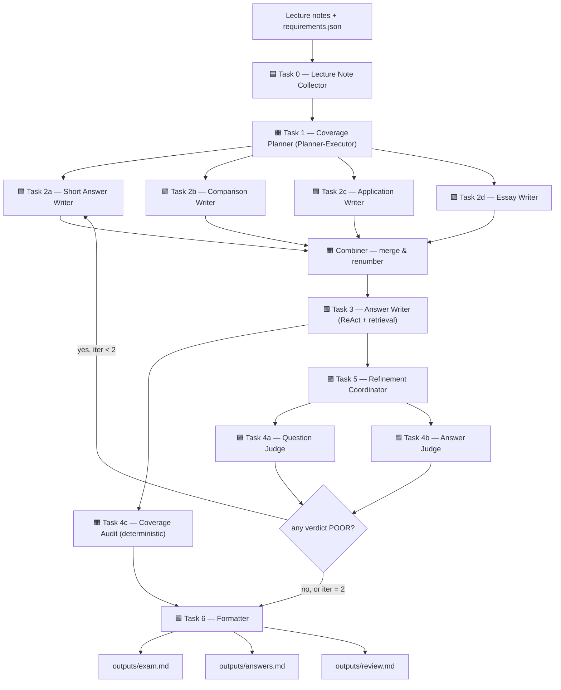

# Agentic Exam Generation Architecture

## Design Goal

Automate ≥ 80% of the exam-generation workflow for the Scientific
Management midterm — read lecture notes and instructor requirements,
plan coverage, draft questions and model answers, judge them with a
rubric, refine the failing items, and emit the final paper, answer
key, and review report. The remaining 20% (final scope confirmation,
fairness review, point allocation) stays with the human instructor.

## Lecture-Material Mapping

The agent layout is taken directly from the four agent-systems
notebooks (M5.3.1.2 / M5.3.2 / M5.3.3 / M5.3.4):

| Lecture concept | Where it lands in this project |
| --- | --- |
| `BaseAgentWorker(name, task_id, run)` (M5.3.1.2 §11) | `src/agents.py` base class for every agent |
| Local tools + JSON DB (M5.3.2 ApplicationCollector / ApplicationDatabase) | `LectureNoteCollectorAgent` + `outputs/processed_notes_db.json` |
| Planner-Executor (M5.3.3 `plan_and_accept`) | `CoveragePlannerAgent` returning a JSON plan |
| Parallel fan-out (M5.3.3 `parallel_screening` + ThreadPoolExecutor) | 4 question-writer specialists run in parallel |
| ReAct + retrieval tool (M5.3.1.2 §8 + M5.3.2 tool calling) | `AnswerWriterAgent` using `search_lecture_notes` |
| LLM-as-Judge JSON rubric (M5.3.4 `JUDGE_*_PROMPT`) | `QuestionJudgeAgent`, `AnswerJudgeAgent` |
| Supervisor-Evaluator reflection loop (M5.3.3 `notification_sender_reflective`) | `RefinementCoordinator` (max 2 iterations) |
| Pilot test + LLM Judge + simulation (M5.3.4 §3-method matrix) | `src/evaluation.py` |

## APD (Agentic Process Diagram)

Color follows the M5.3.1.2 convention:
🟦 Info Acquisition / 🟧 Info Analysis / 🟪 Decision Selection / 🟩 Action Implementation.



## Agent Roster

| Task | Agent class | APD | Pattern | Notes |
| --- | --- | --- | --- | --- |
| 0 | `LectureNoteCollectorAgent` | 🟦 | Local tools + JSON DB | Replaces old `InputParserAgent`. Skips already-registered files. |
| 1 | `CoveragePlannerAgent` | 🟧 | Planner-Executor (`gemini-2.5-pro` → `flash-lite`) | Emits a JSON plan; topic clusters derived from notes, not hardcoded. |
| 2a | `ShortAnswerWriterAgent` | 🟩 | Specialist (parallel) | Definitions/lists, ~5 pts each. |
| 2b | `ComparisonWriterAgent` | 🟩 | Specialist (parallel) | Two paired ideas, ~10 pts each. |
| 2c | `ApplicationWriterAgent` | 🟩 | Specialist (parallel) | Scenario + analytic ask, ~15 pts each. |
| 2d | `EssayWriterAgent` | 🟩 | Specialist (parallel) | Cross-cluster synthesis, ~20 pts. |
| — | `fan_out_question_writers` | 🟧 | ThreadPoolExecutor + Combiner | Renumbers Q1..N across the four batches. |
| 3 | `AnswerWriterAgent` | 🟩 | ReAct + `search_lecture_notes` | Adds `source_refs` per question. |
| 4a | `QuestionJudgeAgent` | 🟪 | LLM-as-Judge (JSON rubric) | scope / difficulty / clarity / answerable. |
| 4b | `AnswerJudgeAgent` | 🟪 | LLM-as-Judge (JSON rubric) | accuracy / completeness / grounded / concise. |
| 4c | `CoverageAuditAgent` | 🟧 | Deterministic | Point sum = 100, full topic coverage, mix matches `requirements.json`. |
| 5 | `RefinementCoordinator` | 🟪 → 🟩 | Supervisor-Evaluator loop | `pass_threshold=13`, `max_iterations=2`. |
| 6 | `FormatterAgent` | 🟩 | Deterministic local tool | Writes exam.md / answers.md / review.md. |

## Data Flow

1. `lecture_notes/raw/` → `scripts/extract_pdf_text.py` → `lecture_notes/processed/*.txt`.
2. `LectureNoteCollectorAgent` validates & registers in `outputs/processed_notes_db.json`.
3. `CoveragePlannerAgent` emits a JSON plan from notes + `requirements.json`.
4. Four question-writer specialists run in parallel; the combiner renumbers.
5. `AnswerWriterAgent` writes a model answer per question via ReAct + retrieval.
6. `CoverageAuditAgent` runs a deterministic structural sanity check.
7. `RefinementCoordinator` runs Question Judge + Answer Judge; failing items are
   regenerated up to 2 iterations with the judge's `suggestion` injected.
8. `FormatterAgent` writes `outputs/exam.md`, `outputs/answers.md`,
   `outputs/review.md` (review.md includes coverage notes, every judge verdict,
   and the full refinement history).

## Memory Strategy (M5.3.2)

| Layer | Use | Implementation |
| --- | --- | --- |
| Internal model knowledge | Domain background (Taylor, Gilbreth, DASSI, etc.) | LLM weights |
| Short-term (chat session) | Avoid duplicate prompts across same-topic questions | `client.chats.create` per specialist (LLM provider) |
| Short-term (summary) | Long lecture corpus that overflows context | `SummaryMemory` pattern available; not used in MVP |
| Long-term (JSON DB) | Already-processed notes; future cross-semester question dedup | `outputs/processed_notes_db.json` (Application Collector pattern) |

## Evaluation (M5.3.4)

`src/evaluation.py` implements the lecture's 3-method matrix:

1. **Pilot test** — 5 `EvalCase`s with expected keyword sets.
   Reports accuracy and per-case keyword coverage.
2. **LLM-as-Judge** — `QuestionJudgeAgent` + `AnswerJudgeAgent`
   scored over the freshly generated draft, aggregated by verdict mix
   and average rubric total.
3. **Simulation** — runs the pipeline N times to measure
   `avg_seconds`, `exams/min`, and a placeholder cost slot to be filled
   when the LLM provider is wired.

Run with:

```bash
python src/evaluation.py --simulate-trials 3
```

Output: `outputs/evaluation_report.json`.

## Provider Hook

Two providers ship with the project, selected at runtime via
`--provider {deterministic,gemini}` or `EXAM_AGENT_PROVIDER=...`.

| Provider | Where | Models | Use |
| --- | --- | --- | --- |
| `DeterministicProvider` | `src/agents.py` | none | Local fallback. Static bank with prompt-level dedup. Runs without a GCP key. |
| `GeminiProvider` | `src/providers.py` | `gemini-2.5-pro` (planner), `gemini-2.5-flash` (writers), `gemini-2.5-flash-lite` (judges) — per M5.3.1.1 cost guidance | Vertex AI mode. Auth via `gcloud auth application-default login` locally or `auth.authenticate_user()` in Colab. |

Both providers expose the same five methods — `plan`, `write_questions`,
`pool_questions`, `write_answer`, `judge_question`, `judge_answer` —
so agent boundaries do not move when the provider is swapped. Per-call
errors in `GeminiProvider` fall back to `DeterministicProvider` so a
transient API failure does not abort the pipeline.

### Switching providers

```bash
# default — deterministic, no API key
python src/main.py

# Gemini via Vertex AI (M5.3.1.1 setup)
pip install google-genai
gcloud auth application-default login
export GCP_PROJECT_ID=<your-project-id>
python src/main.py --provider gemini
```

## Human-in-the-Loop Points

- Confirm whether M3.1.1 Therbligs is in the official midterm scope.
- Sanity-check generated questions for fairness and professor style.
- Override the deterministic refinement when judge suggestions look
  off — the loop is bounded to 2 iterations specifically so the human
  has the final word.
- Final point allocation and grading rubric.
