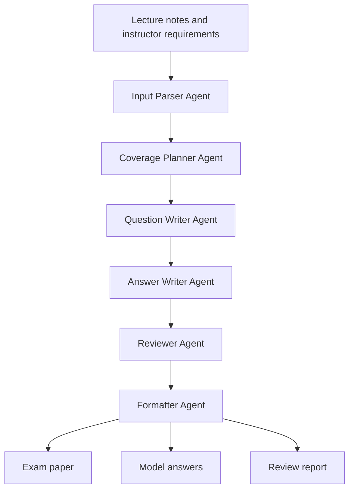

# Agentic Exam Generation Architecture

## Design Goal

The system automates the instructor/TA workflow for creating an exam from
lecture materials and requirements. It should produce a complete exam paper,
model answers, and a review report while leaving the final 20% of judgment to
the human instructor or teaching assistant.

## Agent Workflow

## Agents

| Agent | Responsibility | Output |
| --- | --- | --- |
| Input Parser Agent | Reads extracted lecture text and instructor requirements | Clean topic inventory |
| Coverage Planner Agent | Converts scope into a balanced exam blueprint | Question plan with topic weights |
| Question Writer Agent | Drafts short answer, comparison, application, and essay questions | Exam questions |
| Answer Writer Agent | Writes concise model answers aligned with lecture materials | Answer key |
| Reviewer Agent | Checks coverage, difficulty balance, duplicates, and likely hallucinations | Review notes |
| Formatter Agent | Writes final outputs in a consistent submission format | Markdown exam, answers, review |

## Data Flow

1. Original lecture files are stored in `lecture_notes/raw/`.
2. Text extracted from PDFs is stored in `lecture_notes/processed/`.
3. Instructor constraints are stored in `requirements.json`.
4. The system creates a topic inventory and coverage plan.
5. The exam generator creates questions and model answers.
6. The reviewer flags missing topics, weak alignment, or format issues.
7. Final outputs are written to `outputs/`.

## Human-in-the-Loop Points

- Verify official midterm scope before final generation.
- Review generated questions for fairness and alignment with professor style.
- Remove or revise any hallucinated examples.
- Adjust final point allocation and grading rubric.

## Current MVP Strategy

The first version uses a deterministic local generator so the repository runs
without an API key. This allows the team to test file loading, output format,
and workflow structure immediately.

The next version should replace the deterministic generator with an LLM-backed
provider such as Gemini or OpenAI while keeping the same agent boundaries.

