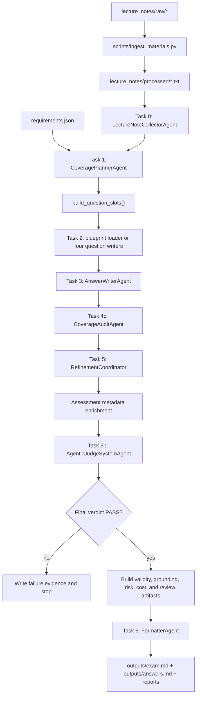

# Agentic Exam Generation Architecture

## Design Goal

This project generates a Scientific Management midterm exam from processed
lecture notes and instructor requirements. It automates ingestion, coverage
planning, question drafting, answer and rubric generation, quality review,
targeted revision, evidence reporting, and final Markdown formatting.

The final release decision remains human-controlled. A machine `PASS` is a
quality gate, not a substitute for instructor review.

## Entry Points

| Command | Purpose |
| --- | --- |
| `python scripts/extract_pdf_text.py` | Convenience wrapper around `scripts/ingest_materials.py` for the default lecture-material directories |
| `python scripts/ingest_materials.py` | Convert supported raw materials into `lecture_notes/processed/*.txt` and write ingestion reports |
| `python scripts/doctor.py` | Check required files, `google-genai`, and Gemini or Vertex authentication |
| `python src/main.py` | Run the exam-generation pipeline |
| `python src/evaluation.py --simulate-trials 3` | Run the offline evaluation harness and write `outputs/evaluation_report.json` |

## Material Ingestion

`scripts/ingest_materials.py` routes files from `lecture_notes/raw/` by
extension:

| Input | Behavior |
| --- | --- |
| PDF | Extract text with `pypdf`; flag low text density as `needs_ocr` |
| TXT / MD | Copy text into the processed directory |
| DOCX | Extract text from `word/document.xml` |
| PPTX | Extract text from slide XML files |
| Images | Record `needs_ocr`; no automatic OCR is performed |
| Audio / video | Record `needs_transcription`; no automatic transcription is performed |

Every processed text file receives a source header. The ingestion step also
writes:

- `outputs/materials_manifest.json`
- `outputs/unsupported_materials_report.md`

## Pipeline Overview

`src/main.py::run_pipeline()` is the orchestrator.


```mermaid
flowchart TD
    RAW["lecture_notes/raw/*"] --> INGEST["scripts/ingest_materials.py"]
    INGEST --> PROCESSED["lecture_notes/processed/*.txt"]
    PROCESSED --> T0["Task 0: LectureNoteCollectorAgent"]
    REQ["requirements.json"] --> T1["Task 1: CoveragePlannerAgent"]
    T0 --> T1
    T1 --> SLOTS["build_question_slots()"]
    SLOTS --> T2["Task 2: blueprint loader or four question writers"]
    T2 --> T3["Task 3: AnswerWriterAgent"]
    T3 --> T4C["Task 4c: CoverageAuditAgent"]
    T4C --> T5["Task 5: RefinementCoordinator"]
    T5 --> META["Assessment metadata enrichment"]
    META --> T5B["Task 5b: AgenticJudgeSystemAgent"]
    T5B --> GATE{"Final verdict PASS?"}
    GATE -- "no" --> FAIL["Write failure evidence and stop"]
    GATE -- "yes" --> REPORTS["Build validity, grounding, risk, cost, and review artifacts"]
    REPORTS --> T6["Task 6: FormatterAgent"]
    T6 --> OUTPUTS["outputs/exam.md + outputs/answers.md + reports"]
```

## Pipeline Stages

### Task 0: Lecture Note Collector

`LectureNoteCollectorAgent` loads non-empty `lecture_notes/processed/*.txt`
files, normalizes filenames, and registers each file's character count in
`outputs/processed_notes_db.json`. Re-runs can identify unchanged processed
notes.

### Task 1: Coverage Planner

`CoveragePlannerAgent` asks the active provider for a topic plan derived from
`requirements.json` and the lecture-note inventory. `build_question_slots()`
then fixes each slot's question type, point value, target topic, focus, coverage
contribution, and difficulty target before drafting starts.

Task 1 is skipped when `--resume-from-judge` loads existing
`outputs/questions.json`.

### Task 2: Question Drafting

Normal generation uses four specialist writers:

| Task | Agent | Type | Default allocation |
| --- | --- | --- | ---: |
| 2a | `ShortAnswerWriterAgent` | Short Answer | 6 x 5 points |
| 2b | `ComparisonWriterAgent` | Concept Comparison | 2 x 10 points |
| 2c | `ApplicationWriterAgent` | Application | 2 x 15 points |
| 2d | `EssayWriterAgent` | Essay | 1 x 20 points |

`fan_out_question_writers()` combines and renumbers their results. Providers
with `batch_write_questions()` generate one batch per question type; the
orchestrator uses one worker for that provider path. Other providers may run
the four specialists with up to four workers.

If the configured `--blueprint` path exists, Task 2 loads its pre-written
questions instead. Pass a nonexistent path to force specialist generation:

```bash
python src/main.py --blueprint nonexistent_path
```

Question writers draft prompt, topic, focus, source references, and metadata
hints. They do not own the final answer or rubric.

### Task 3: Answer and Rubric Writing

`AnswerWriterAgent` fills each question's model answer, rubric, and cleaned
`source_refs`. Live providers use `write_answer_and_rubric()` so rubric
criteria are derived from the answer and normalized to integer points that sum
to the question total.

For live retrieval, `GeminiProvider._question_context()`:

1. Builds retrieval terms from focus, topic, answer, and rubric.
2. Prioritizes passages from cited `source_refs`.
3. Adds globally ranked passages only if cited passages do not fill the limit.
4. Renders each excerpt with a line-span locator such as
   `[source.txt#L10-L25]`.

Stored `source_refs` remain normalized lecture-note filenames. Line spans are
generated dynamically for judge context.

### Task 4c: Deterministic Coverage Audit

`CoverageAuditAgent` checks question count, total points, question mix, and
topic-weight contribution without an LLM call.

### Task 5: First LLM Review Loop

`RefinementCoordinator` runs:

- `QuestionJudgeAgent`
- `AnswerJudgeAgent`

Both judges score JSON rubrics. Items below the default threshold of 13 are
regenerated for up to `--max-refine` iterations. Batch judging is automatically
enabled by `run_pipeline()`, even when `--batch-judge` is omitted.

### Task 5b: Three-Stage Agentic Judge

`AgenticJudgeSystemAgent` runs specialist checks in dependency order:

| Stage | Judge | Main check |
| --- | --- | --- |
| 1 | `CoverageJudgeAgent` | Topic weights and total points |
| 1 | `DifficultyBalanceJudgeAgent` | Difficulty distribution |
| 1 | `PedagogicalQualityJudgeAgent` | Focus, learning objective, and lecture-term alignment |
| 1 | `RedTeamJudgeAgent` | Prompt-level quality risks |
| 1 | `OverlapJudgeAgent` | Cross-question conceptual duplication |
| 2 | `SourceGroundingJudgeAgent` | Valid lecture-note references and lexical support |
| 2 | `FactualGroundingJudgeAgent` | Batched semantic factual review against retrieved excerpts |
| 3 | `AnswerRubricJudgeAgent` | Answer and rubric structural quality |
| 3 | `AnswerConsistencyJudgeAgent` | Batched answer-rubric semantic consistency |
| Aggregate | `JudgeAggregatorAgent` | Final decision by target and exam |

The closed loop uses the earliest failing stage to minimize regeneration:

| Earliest failure | Regeneration scope |
| --- | --- |
| Stage 1 | Question, answer, and rubric |
| Stage 2 | Answer and rubric |
| Stage 3 | Answer and rubric |

Question regeneration includes neighboring same-topic prompts and focuses as
forbidden overlap hints. The loop runs for at most
`--max-agentic-judge-refine` revisions.

### Final Safety Gate

If the agentic judge does not return `PASS`, the pipeline raises
`RuntimeError` before final formatting. It writes the failed evidence:

- `outputs/agentic_judge_report.json`
- `outputs/run_trace.json`
- `outputs/failed_candidate_questions.json`

It does not overwrite the last accepted `exam.md`, `answers.md`,
`questions.json`, or the accepted report set.

On a passing run, any stale `failed_candidate_questions.json` is removed and
the formatter writes the accepted outputs.

## Providers

`src/providers.py::make_provider()` resolves providers in this order:

1. Explicit `--provider`
2. `EXAM_AGENT_PROVIDER`
3. Credential auto-detection
4. Deterministic fallback

| Provider | Class | Authentication |
| --- | --- | --- |
| Deterministic local mode | `ConfiguredDeterministicProvider` | None |
| Gemini via Google AI Studio | `GeminiApiKeyProvider` | `.gemini_api_key`, `GEMINI_API_KEY`, or `GOOGLE_API_KEY` |
| Gemini via Vertex AI | `GeminiProvider` | GCP project environment and Application Default Credentials |
| OpenAI | `OpenAIProvider` | `OPENAI_API_KEY` |
| Anthropic | `AnthropicProvider` | `ANTHROPIC_API_KEY` |

Without `--strict-provider`, unavailable live providers and per-call live
provider failures can fall back to deterministic behavior. Use
`--strict-provider` for final evidence runs.

Role-level model choices come from `model_policy.json`. They can be changed
with `--quality`, `--model-preset`, or role-specific CLI overrides.

## Execution Modes

| Mode | Command pattern | Behavior |
| --- | --- | --- |
| Local structural smoke test | `python src/main.py --provider deterministic` | Runs without billable model calls |
| Fresh live generation | `python src/main.py --provider gemini --quality final_low_cost --strict-provider --blueprint nonexistent_path` | Forces the writer path and stops on live-provider failure |
| Judge-only recheck | `python src/main.py --resume-from-judge --provider gemini --quality final_low_cost --strict-provider` | Loads accepted `outputs/questions.json`; skips Tasks 1-3 |
| Targeted regeneration of accepted questions | `python src/main.py --resume-from-judge --regen-questions 2,6 --provider gemini --quality final_low_cost --strict-provider` | Loads accepted questions, regenerates selected items, then reruns judge phases |

Without `--resume-from-judge`, `--regen-questions` applies to the active
question set produced earlier in the same run.

## Accepted Output Set

A passing run writes:

| Output | Purpose |
| --- | --- |
| `outputs/exam.md` | Student-facing exam |
| `outputs/answers.md` | Instructor-facing answers, metadata, rubrics, and sources |
| `outputs/review.md` | Coverage notes, first-loop judge results, and refinement history |
| `outputs/questions.json` | Structured accepted question records |
| `outputs/coverage_matrix.json` | Required versus actual topic weights |
| `outputs/source_grounding_report.json` | Source-reference existence report |
| `outputs/chunk_grounding_report.json` | Lexical chunk-support report |
| `outputs/agentic_judge_report.json` | Three-stage specialist judge evidence |
| `outputs/assessment_validity_report.json` | Assessment metadata summary |
| `outputs/assessment_validity_report.md` | Human-readable validity report |
| `outputs/residual_risk_report.json` | Remaining risks after automated checks |
| `outputs/human_review_checklist.md` | Instructor review checklist |
| `outputs/human_review_notes_template.json` | Structured human-review template |
| `outputs/critical_discussion.md` | Limitations and defensible claims |
| `outputs/chunk_index.json` | Processed-note chunk metadata |
| `outputs/cost_report.json` | Provider usage and static token estimates |
| `outputs/run_trace.json` | Executed task trace |

## Evaluation and Tests

`src/evaluation.py` provides pilot keyword tests, structural checks, LLM judge
aggregation, and throughput simulation.

The repository test suite currently covers:

- Local Gemini key loading
- Therbligs, DASSI, and Subtraction retrieval context
- Batched factual-grounding and answer-consistency judge calls
- Blocking behavior when factual batch judging is unavailable

Run:

```bash
python -m unittest discover -s tests -v
```

## Human Gate

Before submission, an instructor should:

1. Confirm the official exam scope, especially M3.1.1 Therbligs.
2. Review every cited excerpt for application and essay questions.
3. Check timing, difficulty, fairness, and grading consistency.
4. Complete `outputs/human_review_notes_template.json`.
5. Preserve the strict-provider run evidence with the final submission.
